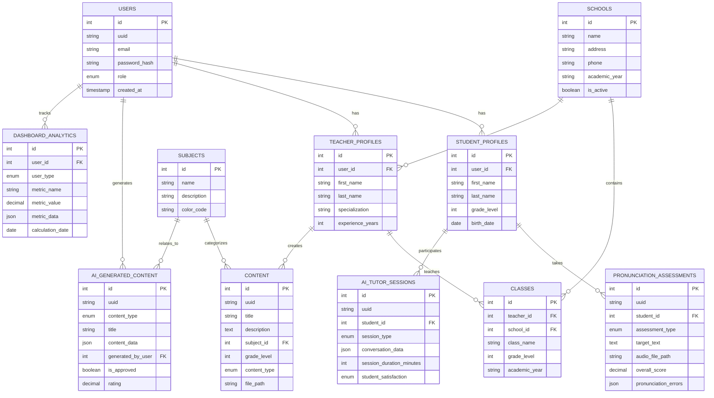
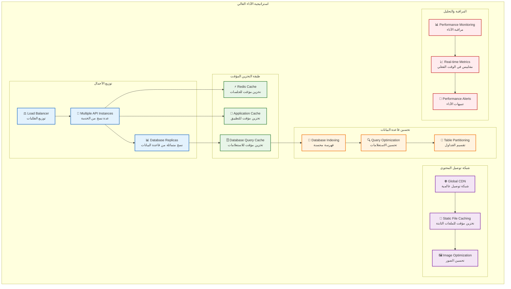

# المخطط المعماري ثلاثي الأبعاد - منصة الداعم التعليمي الذكي

## نظرة عامة

هذا المخطط يوضح البنية المعمارية الشاملة للمنصة التعليمية الذكية مع جميع الطبقات والمكونات والعلاقات بينها.

## المخطط المعماري الرئيسي

```mermaid
graph TB
    subgraph "طبقة العرض - Presentation Layer"
        direction TB
        subgraph "واجهات المستخدم"
            WEB[🌐 تطبيق الويب<br/>React + TypeScript]
            MOBILE[📱 تطبيق الجوال<br/>React Native]
            ADMIN[⚙️ لوحة الإدارة<br/>Admin Dashboard]
        end
        
        subgraph "لوحات التحكم الذكية"
            TEACHER_DASH[👨‍🏫 لوحة المعلم<br/>إحصائيات وأدوات ذكية]
            STUDENT_DASH[👨‍🎓 لوحة الطالب<br/>تقدم شخصي وتوصيات]
            ADMIN_DASH[👨‍💼 لوحة الإدارة<br/>تحليلات شاملة]
        end
    end

    subgraph "طبقة البوابة - API Gateway Layer"
        direction TB
        GATEWAY[🚪 بوابة API<br/>Express.js + TypeScript<br/>Rate Limiting & Security]
        AUTH_MW[🔐 وسطاء المصادقة<br/>JWT Validation]
        CORS_MW[🌍 وسطاء CORS<br/>Cross-Origin Handling]
        LOG_MW[📊 وسطاء التسجيل<br/>Request Logging]
    end

    subgraph "طبقة منطق الأعمال - Business Logic Layer"
        direction TB
        
        subgraph "الخدمات الأساسية"
            AUTH_SVC[🔑 خدمة المصادقة<br/>Authentication Service]
            USER_SVC[👤 خدمة المستخدمين<br/>User Management]
            CONTENT_SVC[📚 خدمة المحتوى<br/>Content Management]
            ASSESS_SVC[📝 خدمة الاختبارات<br/>Assessment Service]
        end
        
        subgraph "خدمات الذكاء الاصطناعي"
            AI_CONTENT[🤖 المعلم الذكي<br/>AI Content Generation]
            AI_SPEECH[🎤 تقييم النطق<br/>Speech Assessment]
            AI_TUTOR[💬 المعلم التفاعلي<br/>Interactive AI Tutor]
            AI_ANALYTICS[📈 التحليلات الذكية<br/>Smart Analytics]
        end
        
        subgraph "خدمات التعليم المتقدمة"
            GAMIFY_SVC[🎮 خدمة التحفيز<br/>Gamification Service]
            NOTIFY_SVC[🔔 خدمة الإشعارات<br/>Notification Service]
            REPORT_SVC[📊 خدمة التقارير<br/>Reporting Service]
            TRACK_SVC[📋 خدمة التتبع<br/>Student Tracking]
        end
    end

    subgraph "طبقة البيانات - Data Layer"
        direction TB
        
        subgraph "قاعدة البيانات الرئيسية"
            MYSQL[(🗄️ MySQL Database<br/>38 جدول)]
            
            subgraph "جداول المستخدمين"
                USERS_TBL[👥 users]
                STUDENTS_TBL[👨‍🎓 student_profiles]
                TEACHERS_TBL[👨‍🏫 teacher_profiles]
            end
            
            subgraph "جداول المحتوى والتعليم"
                CONTENT_TBL[📚 content]
                SUBJECTS_TBL[📖 subjects]
                ASSESSMENTS_TBL[📝 assessments]
                ASSIGNMENTS_TBL[📋 assignments]
            end
            
            subgraph "جداول الذكاء الاصطناعي"
                AI_CONTENT_TBL[🤖 ai_generated_content]
                SPEECH_TBL[🎤 pronunciation_assessments]
                TUTOR_TBL[💬 ai_tutor_sessions]
                ANALYTICS_TBL[📊 dashboard_analytics]
            end
            
            subgraph "جداول الإدارة التعليمية"
                SCHOOLS_TBL[🏫 schools]
                CLASSES_TBL[🏛️ classes]
                RECOVERY_TBL[🔄 recovery_plans]
                TRACKING_TBL[📋 student_tracking]
            end
        end
        
        subgraph "أنظمة التخزين"
            REDIS[(⚡ Redis Cache<br/>Session & Performance)]
            FILES[📁 File Storage<br/>Media & Documents]
            LOGS[📜 Log Storage<br/>System Logs]
        end
    end

    subgraph "الخدمات الخارجية - External Services"
        direction TB
        
        subgraph "خدمات الذكاء الاصطناعي"
            OPENAI[🧠 OpenAI API<br/>Content Generation]
            SPEECH_API[🎙️ Speech Recognition<br/>Pronunciation Analysis]
            NLP_API[🔤 NLP Services<br/>Text Analysis]
        end
        
        subgraph "خدمات الاتصالات"
            EMAIL_SVC[📧 Email Service<br/>SMTP/SendGrid]
            SMS_SVC[📱 SMS Service<br/>Twilio]
            PUSH_SVC[🔔 Push Notifications<br/>Firebase]
        end
        
        subgraph "خدمات التخزين السحابي"
            CLOUD_STORAGE[☁️ Cloud Storage<br/>AWS S3/Google Cloud]
            CDN[🌐 CDN<br/>Content Delivery]
        end
    end

    subgraph "طبقة المراقبة والأمان - Monitoring & Security"
        direction TB
        
        subgraph "المراقبة والتحليل"
            MONITOR[📊 System Monitoring<br/>Performance Metrics]
            ERROR_TRACK[🐛 Error Tracking<br/>Bug Reporting]
            ANALYTICS[📈 Usage Analytics<br/>User Behavior]
        end
        
        subgraph "الأمان والحماية"
            FIREWALL[🛡️ Web Application Firewall]
            ENCRYPT[🔒 Data Encryption<br/>At Rest & In Transit]
            BACKUP[💾 Automated Backups<br/>Data Recovery]
        end
    end

    %% الاتصالات بين الطبقات
    WEB --> GATEWAY
    MOBILE --> GATEWAY
    ADMIN --> GATEWAY
    
    TEACHER_DASH --> GATEWAY
    STUDENT_DASH --> GATEWAY
    ADMIN_DASH --> GATEWAY
    
    GATEWAY --> AUTH_MW
    GATEWAY --> CORS_MW
    GATEWAY --> LOG_MW
    
    AUTH_MW --> AUTH_SVC
    CORS_MW --> USER_SVC
    LOG_MW --> CONTENT_SVC
    
    %% اتصالات الخدمات الأساسية
    AUTH_SVC --> MYSQL
    USER_SVC --> MYSQL
    CONTENT_SVC --> MYSQL
    ASSESS_SVC --> MYSQL
    
    %% اتصالات خدمات الذكاء الاصطناعي
    AI_CONTENT --> OPENAI
    AI_CONTENT --> MYSQL
    AI_SPEECH --> SPEECH_API
    AI_SPEECH --> MYSQL
    AI_TUTOR --> OPENAI
    AI_TUTOR --> MYSQL
    AI_ANALYTICS --> MYSQL
    
    %% اتصالات الخدمات المتقدمة
    GAMIFY_SVC --> MYSQL
    NOTIFY_SVC --> EMAIL_SVC
    NOTIFY_SVC --> SMS_SVC
    NOTIFY_SVC --> PUSH_SVC
    REPORT_SVC --> MYSQL
    TRACK_SVC --> MYSQL
    
    %% اتصالات التخزين
    CONTENT_SVC --> FILES
    AI_CONTENT --> CLOUD_STORAGE
    MYSQL --> BACKUP
    
    %% اتصالات التخزين المؤقت
    AUTH_SVC --> REDIS
    CONTENT_SVC --> REDIS
    AI_ANALYTICS --> REDIS
    
    %% اتصالات المراقبة
    GATEWAY --> MONITOR
    MYSQL --> MONITOR
    AUTH_SVC --> ERROR_TRACK
    
    %% تنسيق الألوان
    classDef presentationLayer fill:#e1f5fe,stroke:#01579b,stroke-width:2px
    classDef gatewayLayer fill:#f3e5f5,stroke:#4a148c,stroke-width:2px
    classDef businessLayer fill:#e8f5e8,stroke:#1b5e20,stroke-width:2px
    classDef dataLayer fill:#fff3e0,stroke:#e65100,stroke-width:2px
    classDef externalLayer fill:#fce4ec,stroke:#880e4f,stroke-width:2px
    classDef securityLayer fill:#f1f8e9,stroke:#33691e,stroke-width:2px
    classDef aiLayer fill:#e3f2fd,stroke:#0d47a1,stroke-width:3px
    
    class WEB,MOBILE,ADMIN,TEACHER_DASH,STUDENT_DASH,ADMIN_DASH presentationLayer
    class GATEWAY,AUTH_MW,CORS_MW,LOG_MW gatewayLayer
    class AUTH_SVC,USER_SVC,CONTENT_SVC,ASSESS_SVC,GAMIFY_SVC,NOTIFY_SVC,REPORT_SVC,TRACK_SVC businessLayer
    class AI_CONTENT,AI_SPEECH,AI_TUTOR,AI_ANALYTICS aiLayer
    class MYSQL,REDIS,FILES,LOGS,USERS_TBL,STUDENTS_TBL,TEACHERS_TBL,CONTENT_TBL,SUBJECTS_TBL,ASSESSMENTS_TBL,ASSIGNMENTS_TBL,AI_CONTENT_TBL,SPEECH_TBL,TUTOR_TBL,ANALYTICS_TBL,SCHOOLS_TBL,CLASSES_TBL,RECOVERY_TBL,TRACKING_TBL dataLayer
    class OPENAI,SPEECH_API,NLP_API,EMAIL_SVC,SMS_SVC,PUSH_SVC,CLOUD_STORAGE,CDN externalLayer
    class MONITOR,ERROR_TRACK,ANALYTICS,FIREWALL,ENCRYPT,BACKUP securityLayer
```

## مخطط تدفق البيانات للذكاء الاصطناعي

```mermaid
graph TD
    subgraph "تدفق توليد المحتوى الذكي"
        USER_REQ[👨‍🏫 طلب المعلم<br/>توليد درس/اختبار/قصة]
        AI_PROCESS[🤖 معالجة الذكاء الاصطناعي<br/>تحليل الطلب وتوليد المحتوى]
        CONTENT_GEN[📝 المحتوى المولد<br/>درس تفاعلي/اختبار/قصة]
        REVIEW[👀 مراجعة وموافقة<br/>تعديل المحتوى إذا لزم الأمر]
        SAVE_CONTENT[💾 حفظ في المكتبة<br/>متاح للاستخدام المستقبلي]
        
        USER_REQ --> AI_PROCESS
        AI_PROCESS --> CONTENT_GEN
        CONTENT_GEN --> REVIEW
        REVIEW --> SAVE_CONTENT
    end

    subgraph "تدفق تقييم النطق الذكي"
        AUDIO_REC[🎤 تسجيل صوتي<br/>من الطالب]
        SPEECH_ANALYSIS[🔍 تحليل النطق<br/>مقارنة مع النموذج الصحيح]
        SCORE_CALC[📊 حساب الدرجات<br/>وضوح، دقة، طلاقة]
        FEEDBACK_GEN[💬 توليد التغذية الراجعة<br/>نصائح للتحسين]
        PROGRESS_UPDATE[📈 تحديث التقدم<br/>تتبع التحسن عبر الزمن]
        
        AUDIO_REC --> SPEECH_ANALYSIS
        SPEECH_ANALYSIS --> SCORE_CALC
        SCORE_CALC --> FEEDBACK_GEN
        FEEDBACK_GEN --> PROGRESS_UPDATE
    end

    subgraph "تدفق المعلم الذكي التفاعلي"
        STUDENT_Q[❓ سؤال الطالب<br/>طلب مساعدة/شرح]
        CONTEXT_ANALYSIS[🧠 تحليل السياق<br/>فهم احتياجات الطالب]
        AI_RESPONSE[💭 استجابة ذكية<br/>شرح مخصص ومناسب]
        LEARNING_TRACK[📚 تتبع التعلم<br/>تسجيل التقدم والفهم]
        ADAPT_LEVEL[🎯 تكيف المستوى<br/>تعديل الصعوبة حسب الأداء]
        
        STUDENT_Q --> CONTEXT_ANALYSIS
        CONTEXT_ANALYSIS --> AI_RESPONSE
        AI_RESPONSE --> LEARNING_TRACK
        LEARNING_TRACK --> ADAPT_LEVEL
    end

    %% تنسيق الألوان للتدفقات
    classDef contentFlow fill:#e8f5e8,stroke:#2e7d32,stroke-width:2px
    classDef speechFlow fill:#e3f2fd,stroke:#1565c0,stroke-width:2px
    classDef tutorFlow fill:#fce4ec,stroke:#c2185b,stroke-width:2px
    
    class USER_REQ,AI_PROCESS,CONTENT_GEN,REVIEW,SAVE_CONTENT contentFlow
    class AUDIO_REC,SPEECH_ANALYSIS,SCORE_CALC,FEEDBACK_GEN,PROGRESS_UPDATE speechFlow
    class STUDENT_Q,CONTEXT_ANALYSIS,AI_RESPONSE,LEARNING_TRACK,ADAPT_LEVEL tutorFlow
```

## مخطط قاعدة البيانات ثلاثي الأبعاد

## مخطط الأمان والحماية

```mermaid
graph TB
    subgraph "طبقات الأمان المتعددة"
        subgraph "الحماية الخارجية"
            WAF[🛡️ Web Application Firewall<br/>حماية من الهجمات]
            DDOS[⚡ DDoS Protection<br/>حماية من هجمات الحرمان]
            SSL[🔒 SSL/TLS Encryption<br/>تشفير البيانات أثناء النقل]
        end
        
        subgraph "طبقة المصادقة والتفويض"
            JWT_AUTH[🎫 JWT Authentication<br/>رموز الوصول الآمنة]
            RBAC[👥 Role-Based Access Control<br/>التحكم في الصلاحيات]
            MFA[🔐 Multi-Factor Authentication<br/>المصادقة متعددة العوامل]
        end
        
        subgraph "حماية البيانات"
            DATA_ENCRYPT[🔐 Data Encryption at Rest<br/>تشفير البيانات المخزنة]
            FIELD_ENCRYPT[🔒 Field-Level Encryption<br/>تشفير الحقول الحساسة]
            HASH_PASS[#️⃣ Password Hashing<br/>تشفير كلمات المرور]
        end
        
        subgraph "المراقبة والتسجيل"
            AUDIT_LOG[📋 Audit Logging<br/>تسجيل جميع العمليات]
            INTRUSION[🚨 Intrusion Detection<br/>كشف التسلل]
            ALERT_SYS[🔔 Alert System<br/>نظام التنبيهات الأمنية]
        end
        
        subgraph "النسخ الاحتياطية والاستعادة"
            AUTO_BACKUP[💾 Automated Backups<br/>نسخ احتياطية تلقائية]
            DISASTER_REC[🔄 Disaster Recovery<br/>خطة استعادة الكوارث]
            DATA_INTEGRITY[✅ Data Integrity Checks<br/>فحص سلامة البيانات]
        end
    end
    
    %% تدفق الأمان
    WAF --> JWT_AUTH
    DDOS --> JWT_AUTH
    SSL --> JWT_AUTH
    
    JWT_AUTH --> RBAC
    RBAC --> MFA
    
    MFA --> DATA_ENCRYPT
    DATA_ENCRYPT --> FIELD_ENCRYPT
    FIELD_ENCRYPT --> HASH_PASS
    
    HASH_PASS --> AUDIT_LOG
    AUDIT_LOG --> INTRUSION
    INTRUSION --> ALERT_SYS
    
    ALERT_SYS --> AUTO_BACKUP
    AUTO_BACKUP --> DISASTER_REC
    DISASTER_REC --> DATA_INTEGRITY
    
    %% تنسيق الألوان
    classDef securityLayer fill:#ffebee,stroke:#c62828,stroke-width:2px
    classDef authLayer fill:#e8f5e8,stroke:#2e7d32,stroke-width:2px
    classDef dataLayer fill:#e3f2fd,stroke:#1565c0,stroke-width:2px
    classDef monitorLayer fill:#fff3e0,stroke:#ef6c00,stroke-width:2px
    classDef backupLayer fill:#f3e5f5,stroke:#7b1fa2,stroke-width:2px
    
    class WAF,DDOS,SSL securityLayer
    class JWT_AUTH,RBAC,MFA authLayer
    class DATA_ENCRYPT,FIELD_ENCRYPT,HASH_PASS dataLayer
    class AUDIT_LOG,INTRUSION,ALERT_SYS monitorLayer
    class AUTO_BACKUP,DISASTER_REC,DATA_INTEGRITY backupLayer
```

## مخطط الأداء وقابلية التوسع

## الخصائص التقنية الرئيسية

### 🏗️ البنية المعمارية
- **نمط Clean Architecture** مع فصل واضح بين الطبقات
- **Microservices Ready** قابل للتوسع إلى خدمات مصغرة
- **Event-Driven Architecture** للتفاعل بين المكونات

### 🤖 الذكاء الاصطناعي
- **4 خدمات ذكية متقدمة** لتوليد المحتوى وتقييم النطق
- **تكامل مع OpenAI** لتوليد محتوى تعليمي متقدم
- **تحليل صوتي ذكي** لتقييم النطق العربي
- **معلم تفاعلي** للمساعدة في الواجبات والشرح

### 🗄️ قاعدة البيانات
- **38 جدولاً شاملاً** تغطي جميع جوانب النظام التعليمي
- **7 جداول جديدة للذكاء الاصطناعي** لدعم الميزات الذكية
- **فهرسة محسنة** لضمان الأداء العالي
- **نسخ احتياطية تلقائية** لحماية البيانات

### 🔒 الأمان والحماية
- **تشفير شامل** للبيانات أثناء التخزين والنقل
- **مصادقة متعددة العوامل** لحماية الحسابات
- **تسجيل شامل للأنشطة** لمراقبة الأمان
- **حماية من الهجمات** مع Web Application Firewall

### ⚡ الأداء وقابلية التوسع
- **دعم 1000+ مستخدم متزامن** مع أداء عالي
- **تخزين مؤقت متعدد المستويات** لتحسين السرعة
- **شبكة توصيل محتوى عالمية** لتسريع التحميل
- **مراقبة في الوقت الفعلي** للأداء والمقاييس

## الملاحظات التقنية

1. **التوافق مع المعايير**: جميع المكونات تتبع أفضل الممارسات الصناعية
2. **قابلية الصيانة**: كود منظم وموثق بشكل شامل
3. **المرونة**: قابل للتخصيص والتوسع حسب الحاجة
4. **الموثوقية**: نظام مراقبة شامل مع إنذارات تلقائية
5. **الأمان**: حماية متعددة الطبقات لضمان أمان البيانات

هذا المخطط يوضح البنية الشاملة للمنصة التعليمية الذكية مع جميع المكونات والعلاقات بينها، مما يوفر رؤية واضحة للمطورين والمهندسين لفهم النظام وتطويره بفعالية.