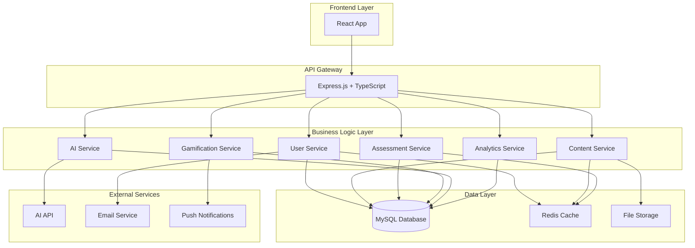

# تصميم النظام - منصة الداعم التعليمي الذكي

## نظرة عامة

تصميم backend شامل لمنصة تعليمية ذكية باستخدام Node.js + TypeScript مع قاعدة بيانات MySQL، يدعم آلاف المستخدمين المتزامنين ويوفر تجربة تعليمية متقدمة مع الذكاء الاصطناعي.

## البنية العامة

### نمط المعمارية
- **Clean Architecture**: فصل واضح بين طبقات العمل
- **Microservices Ready**: قابل للتوسع إلى خدمات مصغرة
- **Event-Driven**: نظام أحداث للتفاعل بين المكونات



## تصميم قاعدة البيانات MySQL

### الجداول الأساسية

#### 1. جدول المستخدمين (users)
```sql
CREATE TABLE users (
    id INT PRIMARY KEY AUTO_INCREMENT,
    uuid VARCHAR(36) UNIQUE NOT NULL,
    email VARCHAR(255) UNIQUE NOT NULL,
    password_hash VARCHAR(255) NOT NULL,
    first_name VARCHAR(100) NOT NULL,
    last_name VARCHAR(100) NOT NULL,
    role ENUM('student', 'teacher', 'admin') NOT NULL,
    avatar_url VARCHAR(500),
    phone VARCHAR(20),
    date_of_birth DATE,
    gender ENUM('male', 'female'),
    is_active BOOLEAN DEFAULT TRUE,
    email_verified BOOLEAN DEFAULT FALSE,
    last_login TIMESTAMP,
    created_at TIMESTAMP DEFAULT CURRENT_TIMESTAMP,
    updated_at TIMESTAMP DEFAULT CURRENT_TIMESTAMP ON UPDATE CURRENT_TIMESTAMP,
    
    INDEX idx_email (email),
    INDEX idx_role (role),
    INDEX idx_active (is_active)
);
```

#### 2. ملفات الطلاب (student_profiles)
```sql
CREATE TABLE student_profiles (
    id INT PRIMARY KEY AUTO_INCREMENT,
    user_id INT NOT NULL,
    student_id VARCHAR(50) UNIQUE,
    grade_level INT NOT NULL,
    class_section VARCHAR(10),
    parent_name VARCHAR(200),
    parent_phone VARCHAR(20),
    parent_email VARCHAR(255),
    total_points INT DEFAULT 0,
    current_level INT DEFAULT 1,
    current_streak INT DEFAULT 0,
    longest_streak INT DEFAULT 0,
    
    FOREIGN KEY (user_id) REFERENCES users(id) ON DELETE CASCADE,
    INDEX idx_grade (grade_level),
    INDEX idx_points (total_points),
    INDEX idx_level (current_level)
);
```

#### 3. ملفات المعلمين (teacher_profiles)
```sql
CREATE TABLE teacher_profiles (
    id INT PRIMARY KEY AUTO_INCREMENT,
    user_id INT NOT NULL,
    employee_id VARCHAR(50) UNIQUE,
    school_id INT,
    specialization VARCHAR(100),
    years_experience INT,
    qualification VARCHAR(200),
    academic_year VARCHAR(20) NOT NULL,
    bio TEXT,
    
    FOREIGN KEY (user_id) REFERENCES users(id) ON DELETE CASCADE,
    FOREIGN KEY (school_id) REFERENCES schools(id),
    INDEX idx_school_year (school_id, academic_year)
);
```

#### 4. المواد الدراسية (subjects)
```sql
CREATE TABLE subjects (
    id INT PRIMARY KEY AUTO_INCREMENT,
    name VARCHAR(100) NOT NULL,
    name_ar VARCHAR(100) NOT NULL,
    description TEXT,
    icon VARCHAR(100),
    color VARCHAR(7),
    grade_levels JSON, -- [4, 5, 6]
    is_active BOOLEAN DEFAULT TRUE,
    created_at TIMESTAMP DEFAULT CURRENT_TIMESTAMP
);
```

#### 5. المحتوى التعليمي (content)
```sql
CREATE TABLE content (
    id INT PRIMARY KEY AUTO_INCREMENT,
    uuid VARCHAR(36) UNIQUE NOT NULL,
    title VARCHAR(255) NOT NULL,
    description TEXT,
    content_type ENUM('lesson', 'video', 'document', 'interactive') NOT NULL,
    subject_id INT NOT NULL,
    grade_level INT NOT NULL,
    difficulty_level ENUM('easy', 'medium', 'hard') NOT NULL,
    duration_minutes INT,
    thumbnail_url VARCHAR(500),
    content_url VARCHAR(500),
    metadata JSON, -- Additional content-specific data
    view_count INT DEFAULT 0,
    like_count INT DEFAULT 0,
    created_by INT NOT NULL,
    is_published BOOLEAN DEFAULT FALSE,
    published_at TIMESTAMP NULL,
    created_at TIMESTAMP DEFAULT CURRENT_TIMESTAMP,
    updated_at TIMESTAMP DEFAULT CURRENT_TIMESTAMP ON UPDATE CURRENT_TIMESTAMP,
    
    FOREIGN KEY (subject_id) REFERENCES subjects(id),
    FOREIGN KEY (created_by) REFERENCES users(id),
    INDEX idx_subject_grade (subject_id, grade_level),
    INDEX idx_published (is_published),
    INDEX idx_difficulty (difficulty_level),
    FULLTEXT idx_search (title, description)
);
```

#### 6. الاختبارات (assessments)
```sql
CREATE TABLE assessments (
    id INT PRIMARY KEY AUTO_INCREMENT,
    uuid VARCHAR(36) UNIQUE NOT NULL,
    title VARCHAR(255) NOT NULL,
    description TEXT,
    subject_id INT NOT NULL,
    grade_level INT NOT NULL,
    difficulty_level ENUM('easy', 'medium', 'hard') NOT NULL,
    duration_minutes INT NOT NULL,
    total_questions INT NOT NULL,
    passing_score INT NOT NULL,
    max_attempts INT DEFAULT 3,
    is_randomized BOOLEAN DEFAULT FALSE,
    created_by INT NOT NULL,
    is_published BOOLEAN DEFAULT FALSE,
    published_at TIMESTAMP NULL,
    created_at TIMESTAMP DEFAULT CURRENT_TIMESTAMP,
    updated_at TIMESTAMP DEFAULT CURRENT_TIMESTAMP ON UPDATE CURRENT_TIMESTAMP,
    
    FOREIGN KEY (subject_id) REFERENCES subjects(id),
    FOREIGN KEY (created_by) REFERENCES users(id),
    INDEX idx_subject_grade (subject_id, grade_level)
);
```

#### 7. أسئلة الاختبارات (assessment_questions)
```sql
CREATE TABLE assessment_questions (
    id INT PRIMARY KEY AUTO_INCREMENT,
    assessment_id INT NOT NULL,
    question_text TEXT NOT NULL,
    question_type ENUM('multiple_choice', 'true_false', 'fill_blank', 'essay') NOT NULL,
    options JSON, -- For multiple choice: ["option1", "option2", ...]
    correct_answer TEXT NOT NULL,
    explanation TEXT,
    points INT DEFAULT 1,
    order_index INT NOT NULL,
    
    FOREIGN KEY (assessment_id) REFERENCES assessments(id) ON DELETE CASCADE,
    INDEX idx_assessment_order (assessment_id, order_index)
);
```

#### 8. محاولات الاختبارات (assessment_attempts)
```sql
CREATE TABLE assessment_attempts (
    id INT PRIMARY KEY AUTO_INCREMENT,
    uuid VARCHAR(36) UNIQUE NOT NULL,
    assessment_id INT NOT NULL,
    student_id INT NOT NULL,
    started_at TIMESTAMP DEFAULT CURRENT_TIMESTAMP,
    completed_at TIMESTAMP NULL,
    duration_seconds INT,
    total_score INT DEFAULT 0,
    percentage_score DECIMAL(5,2) DEFAULT 0,
    status ENUM('in_progress', 'completed', 'abandoned', 'expired') DEFAULT 'in_progress',
    answers JSON, -- Store all answers
    
    FOREIGN KEY (assessment_id) REFERENCES assessments(id),
    FOREIGN KEY (student_id) REFERENCES users(id),
    INDEX idx_student_assessment (student_id, assessment_id),
    INDEX idx_status (status)
);
```

#### 9. الواجبات (assignments)
```sql
CREATE TABLE assignments (
    id INT PRIMARY KEY AUTO_INCREMENT,
    uuid VARCHAR(36) UNIQUE NOT NULL,
    title VARCHAR(255) NOT NULL,
    description TEXT,
    subject_id INT NOT NULL,
    grade_level INT NOT NULL,
    assignment_type ENUM('homework', 'project', 'quiz', 'essay') NOT NULL,
    instructions TEXT,
    attachments JSON, -- File URLs
    due_date TIMESTAMP NOT NULL,
    max_score INT DEFAULT 100,
    created_by INT NOT NULL,
    is_published BOOLEAN DEFAULT FALSE,
    created_at TIMESTAMP DEFAULT CURRENT_TIMESTAMP,
    updated_at TIMESTAMP DEFAULT CURRENT_TIMESTAMP ON UPDATE CURRENT_TIMESTAMP,
    
    FOREIGN KEY (subject_id) REFERENCES subjects(id),
    FOREIGN KEY (created_by) REFERENCES users(id),
    INDEX idx_due_date (due_date),
    INDEX idx_subject_grade (subject_id, grade_level)
);
```

#### 10. تسليم الواجبات (assignment_submissions)
```sql
CREATE TABLE assignment_submissions (
    id INT PRIMARY KEY AUTO_INCREMENT,
    assignment_id INT NOT NULL,
    student_id INT NOT NULL,
    submission_text TEXT,
    attachments JSON, -- File URLs
    submitted_at TIMESTAMP DEFAULT CURRENT_TIMESTAMP,
    score INT NULL,
    feedback TEXT,
    graded_by INT NULL,
    graded_at TIMESTAMP NULL,
    status ENUM('submitted', 'graded', 'returned', 'late') DEFAULT 'submitted',
    
    FOREIGN KEY (assignment_id) REFERENCES assignments(id),
    FOREIGN KEY (student_id) REFERENCES users(id),
    FOREIGN KEY (graded_by) REFERENCES users(id),
    UNIQUE KEY unique_submission (assignment_id, student_id),
    INDEX idx_status (status)
);
```

#### 11. نظام النقاط (points_transactions)
```sql
CREATE TABLE points_transactions (
    id INT PRIMARY KEY AUTO_INCREMENT,
    student_id INT NOT NULL,
    points INT NOT NULL, -- Can be negative for deductions
    transaction_type ENUM('lesson_complete', 'assessment_pass', 'assignment_submit', 'daily_login', 'streak_bonus', 'manual_adjustment') NOT NULL,
    reference_id INT NULL, -- ID of related content/assessment/assignment
    reference_type VARCHAR(50) NULL,
    description VARCHAR(255),
    created_at TIMESTAMP DEFAULT CURRENT_TIMESTAMP,
    
    FOREIGN KEY (student_id) REFERENCES users(id),
    INDEX idx_student_date (student_id, created_at),
    INDEX idx_type (transaction_type)
);
```

#### 12. الشارات (badges)
```sql
CREATE TABLE badges (
    id INT PRIMARY KEY AUTO_INCREMENT,
    name VARCHAR(100) NOT NULL,
    name_ar VARCHAR(100) NOT NULL,
    description TEXT,
    description_ar TEXT,
    icon VARCHAR(100) NOT NULL,
    color VARCHAR(7),
    criteria JSON, -- Conditions to earn this badge
    points_reward INT DEFAULT 0,
    rarity ENUM('common', 'rare', 'epic', 'legendary') DEFAULT 'common',
    is_active BOOLEAN DEFAULT TRUE,
    created_at TIMESTAMP DEFAULT CURRENT_TIMESTAMP
);
```

#### 13. شارات الطلاب (student_badges)
```sql
CREATE TABLE student_badges (
    id INT PRIMARY KEY AUTO_INCREMENT,
    student_id INT NOT NULL,
    badge_id INT NOT NULL,
    earned_at TIMESTAMP DEFAULT CURRENT_TIMESTAMP,
    progress_data JSON, -- Track progress towards badge
    
    FOREIGN KEY (student_id) REFERENCES users(id),
    FOREIGN KEY (badge_id) REFERENCES badges(id),
    UNIQUE KEY unique_student_badge (student_id, badge_id),
    INDEX idx_earned_date (earned_at)
);
```

#### 14. المحتوى المُولد بالذكاء الاصطناعي (ai_generated_content)
```sql
CREATE TABLE ai_generated_content (
    id INT PRIMARY KEY AUTO_INCREMENT,
    uuid VARCHAR(36) UNIQUE NOT NULL,
    content_type ENUM('lesson_plan', 'quiz', 'story', 'exercise') NOT NULL,
    prompt TEXT NOT NULL,
    generated_content LONGTEXT NOT NULL,
    subject_id INT,
    grade_level INT,
    difficulty_level ENUM('easy', 'medium', 'hard'),
    created_by INT NOT NULL,
    is_saved BOOLEAN DEFAULT FALSE,
    rating INT NULL, -- 1-5 rating by teacher
    created_at TIMESTAMP DEFAULT CURRENT_TIMESTAMP,
    
    FOREIGN KEY (subject_id) REFERENCES subjects(id),
    FOREIGN KEY (created_by) REFERENCES users(id),
    INDEX idx_creator_type (created_by, content_type),
    INDEX idx_saved (is_saved)
);
```

#### 15. الإشعارات (notifications)
```sql
CREATE TABLE notifications (
    id INT PRIMARY KEY AUTO_INCREMENT,
    uuid VARCHAR(36) UNIQUE NOT NULL,
    user_id INT NOT NULL,
    title VARCHAR(255) NOT NULL,
    message TEXT NOT NULL,
    notification_type ENUM('assignment', 'grade', 'achievement', 'reminder', 'system') NOT NULL,
    reference_id INT NULL,
    reference_type VARCHAR(50) NULL,
    is_read BOOLEAN DEFAULT FALSE,
    sent_at TIMESTAMP DEFAULT CURRENT_TIMESTAMP,
    read_at TIMESTAMP NULL,
    
    FOREIGN KEY (user_id) REFERENCES users(id),
    INDEX idx_user_read (user_id, is_read),
    INDEX idx_sent_date (sent_at)
);
```

#### 16. جلسات المستخدمين (user_sessions)
```sql
CREATE TABLE user_sessions (
    id INT PRIMARY KEY AUTO_INCREMENT,
    user_id INT NOT NULL,
    session_token VARCHAR(255) UNIQUE NOT NULL,
    refresh_token VARCHAR(255) UNIQUE NOT NULL,
    ip_address VARCHAR(45),
    user_agent TEXT,
    expires_at TIMESTAMP NOT NULL,
    created_at TIMESTAMP DEFAULT CURRENT_TIMESTAMP,
    last_activity TIMESTAMP DEFAULT CURRENT_TIMESTAMP ON UPDATE CURRENT_TIMESTAMP,
    
    FOREIGN KEY (user_id) REFERENCES users(id) ON DELETE CASCADE,
    INDEX idx_session_token (session_token),
    INDEX idx_user_expires (user_id, expires_at)
);
```

#### 17. المدارس (schools)
```sql
CREATE TABLE schools (
    id INT PRIMARY KEY AUTO_INCREMENT,
    name VARCHAR(255) NOT NULL,
    address TEXT,
    phone VARCHAR(20),
    email VARCHAR(255),
    principal_name VARCHAR(200),
    academic_year VARCHAR(20) NOT NULL,
    is_active BOOLEAN DEFAULT TRUE,
    created_at TIMESTAMP DEFAULT CURRENT_TIMESTAMP,
    updated_at TIMESTAMP DEFAULT CURRENT_TIMESTAMP ON UPDATE CURRENT_TIMESTAMP,
    
    INDEX idx_academic_year (academic_year),
    INDEX idx_active (is_active)
);
```

#### 18. الصفوف والشعب (classes)
```sql
CREATE TABLE classes (
    id INT PRIMARY KEY AUTO_INCREMENT,
    teacher_id INT NOT NULL,
    school_id INT,
    class_name VARCHAR(100) NOT NULL,
    grade_level INT NOT NULL,
    section VARCHAR(10),
    academic_year VARCHAR(20) NOT NULL,
    max_students INT DEFAULT 30,
    is_active BOOLEAN DEFAULT TRUE,
    created_at TIMESTAMP DEFAULT CURRENT_TIMESTAMP,
    updated_at TIMESTAMP DEFAULT CURRENT_TIMESTAMP ON UPDATE CURRENT_TIMESTAMP,
    
    FOREIGN KEY (teacher_id) REFERENCES users(id),
    FOREIGN KEY (school_id) REFERENCES schools(id),
    INDEX idx_teacher_year (teacher_id, academic_year),
    INDEX idx_grade_level (grade_level)
);
```

#### 19. انتماء الطلاب للصفوف (student_class_enrollment)
```sql
CREATE TABLE student_class_enrollment (
    id INT PRIMARY KEY AUTO_INCREMENT,
    student_id INT NOT NULL,
    class_id INT NOT NULL,
    enrollment_date DATE NOT NULL,
    withdrawal_date DATE NULL,
    status ENUM('active', 'transferred', 'withdrawn') DEFAULT 'active',
    created_at TIMESTAMP DEFAULT CURRENT_TIMESTAMP,
    
    FOREIGN KEY (student_id) REFERENCES users(id),
    FOREIGN KEY (class_id) REFERENCES classes(id),
    INDEX idx_student_active (student_id, status),
    INDEX idx_class_active (class_id, status)
);
```

#### 20. خطط تعويض الفاقد (recovery_plans)
```sql
CREATE TABLE recovery_plans (
    id INT PRIMARY KEY AUTO_INCREMENT,
    uuid VARCHAR(36) UNIQUE NOT NULL,
    week_number INT NOT NULL,
    title VARCHAR(255) NOT NULL,
    action_description TEXT NOT NULL,
    subject_id INT,
    grade_level INT,
    file_name VARCHAR(255),
    file_path VARCHAR(500),
    file_type VARCHAR(50),
    created_by INT NOT NULL,
    is_active BOOLEAN DEFAULT TRUE,
    created_at TIMESTAMP DEFAULT CURRENT_TIMESTAMP,
    updated_at TIMESTAMP DEFAULT CURRENT_TIMESTAMP ON UPDATE CURRENT_TIMESTAMP,
    
    FOREIGN KEY (subject_id) REFERENCES subjects(id),
    FOREIGN KEY (created_by) REFERENCES users(id),
    INDEX idx_week_subject (week_number, subject_id),
    INDEX idx_grade_level (grade_level),
    INDEX idx_active (is_active)
);
```

#### 21. خطط تعزيز الفاقد (enhancement_plans)
```sql
CREATE TABLE enhancement_plans (
    id INT PRIMARY KEY AUTO_INCREMENT,
    uuid VARCHAR(36) UNIQUE NOT NULL,
    week_number INT NOT NULL,
    title VARCHAR(255) NOT NULL,
    action_description TEXT NOT NULL,
    subject_id INT,
    grade_level INT,
    file_name VARCHAR(255),
    file_path VARCHAR(500),
    file_type VARCHAR(50),
    created_by INT NOT NULL,
    is_active BOOLEAN DEFAULT TRUE,
    created_at TIMESTAMP DEFAULT CURRENT_TIMESTAMP,
    updated_at TIMESTAMP DEFAULT CURRENT_TIMESTAMP ON UPDATE CURRENT_TIMESTAMP,
    
    FOREIGN KEY (subject_id) REFERENCES subjects(id),
    FOREIGN KEY (created_by) REFERENCES users(id),
    INDEX idx_week_subject (week_number, subject_id),
    INDEX idx_grade_level (grade_level),
    INDEX idx_active (is_active)
);
```

#### 22. تقدم الطلاب في خطط التعويض (student_recovery_progress)
```sql
CREATE TABLE student_recovery_progress (
    id INT PRIMARY KEY AUTO_INCREMENT,
    student_id INT NOT NULL,
    plan_id INT NOT NULL,
    assigned_date DATE NOT NULL,
    completed_date DATE NULL,
    completion_status ENUM('not_started', 'in_progress', 'completed', 'needs_review') DEFAULT 'not_started',
    score INT NULL,
    notes TEXT,
    teacher_feedback TEXT,
    created_at TIMESTAMP DEFAULT CURRENT_TIMESTAMP,
    updated_at TIMESTAMP DEFAULT CURRENT_TIMESTAMP ON UPDATE CURRENT_TIMESTAMP,
    
    FOREIGN KEY (student_id) REFERENCES users(id),
    FOREIGN KEY (plan_id) REFERENCES recovery_plans(id),
    UNIQUE KEY unique_student_plan (student_id, plan_id),
    INDEX idx_status (completion_status),
    INDEX idx_assigned_date (assigned_date)
);
```

#### 23. تقدم الطلاب في خطط التعزيز (student_enhancement_progress)
```sql
CREATE TABLE student_enhancement_progress (
    id INT PRIMARY KEY AUTO_INCREMENT,
    student_id INT NOT NULL,
    plan_id INT NOT NULL,
    assigned_date DATE NOT NULL,
    completed_date DATE NULL,
    completion_status ENUM('not_started', 'in_progress', 'completed', 'excellent') DEFAULT 'not_started',
    score INT NULL,
    notes TEXT,
    teacher_feedback TEXT,
    created_at TIMESTAMP DEFAULT CURRENT_TIMESTAMP,
    updated_at TIMESTAMP DEFAULT CURRENT_TIMESTAMP ON UPDATE CURRENT_TIMESTAMP,
    
    FOREIGN KEY (student_id) REFERENCES users(id),
    FOREIGN KEY (plan_id) REFERENCES enhancement_plans(id),
    UNIQUE KEY unique_student_plan (student_id, plan_id),
    INDEX idx_status (completion_status),
    INDEX idx_assigned_date (assigned_date)
);
```

#### 24. الاختبارات التشخيصية (diagnostic_tests)
```sql
CREATE TABLE diagnostic_tests (
    id INT PRIMARY KEY AUTO_INCREMENT,
    uuid VARCHAR(36) UNIQUE NOT NULL,
    title VARCHAR(255) NOT NULL,
    description TEXT,
    subject_id INT,
    grade_level INT,
    test_type ENUM('written', 'oral', 'practical', 'mixed') NOT NULL,
    file_name VARCHAR(255),
    file_path VARCHAR(500),
    duration_minutes INT,
    max_score INT DEFAULT 100,
    created_by INT NOT NULL,
    is_active BOOLEAN DEFAULT TRUE,
    created_at TIMESTAMP DEFAULT CURRENT_TIMESTAMP,
    updated_at TIMESTAMP DEFAULT CURRENT_TIMESTAMP ON UPDATE CURRENT_TIMESTAMP,
    
    FOREIGN KEY (subject_id) REFERENCES subjects(id),
    FOREIGN KEY (created_by) REFERENCES users(id),
    INDEX idx_subject_grade (subject_id, grade_level),
    INDEX idx_type (test_type),
    INDEX idx_active (is_active)
);
```

#### 25. نتائج الاختبارات التشخيصية (diagnostic_test_results)
```sql
CREATE TABLE diagnostic_test_results (
    id INT PRIMARY KEY AUTO_INCREMENT,
    test_id INT NOT NULL,
    student_id INT NOT NULL,
    score INT NOT NULL,
    max_score INT NOT NULL,
    percentage_score DECIMAL(5,2) NOT NULL,
    test_date DATE NOT NULL,
    strengths TEXT,
    weaknesses TEXT,
    recommendations TEXT,
    teacher_notes TEXT,
    created_at TIMESTAMP DEFAULT CURRENT_TIMESTAMP,
    
    FOREIGN KEY (test_id) REFERENCES diagnostic_tests(id),
    FOREIGN KEY (student_id) REFERENCES users(id),
    INDEX idx_student_test (student_id, test_id),
    INDEX idx_test_date (test_date),
    INDEX idx_score (percentage_score)
);
```

#### 26. تتبع الطلاب (student_tracking)
```sql
CREATE TABLE student_tracking (
    id INT PRIMARY KEY AUTO_INCREMENT,
    teacher_id INT NOT NULL,
    student_id INT NOT NULL,
    tracking_type ENUM('academic', 'behavioral', 'social', 'attendance', 'health') NOT NULL,
    title VARCHAR(255) NOT NULL,
    details TEXT NOT NULL,
    tracking_date DATE NOT NULL,
    priority ENUM('low', 'medium', 'high', 'urgent') DEFAULT 'medium',
    status ENUM('open', 'in_progress', 'resolved', 'closed') DEFAULT 'open',
    notes TEXT,
    follow_up_date DATE NULL,
    created_at TIMESTAMP DEFAULT CURRENT_TIMESTAMP,
    updated_at TIMESTAMP DEFAULT CURRENT_TIMESTAMP ON UPDATE CURRENT_TIMESTAMP,
    
    FOREIGN KEY (teacher_id) REFERENCES users(id),
    FOREIGN KEY (student_id) REFERENCES users(id),
    INDEX idx_student_type (student_id, tracking_type),
    INDEX idx_teacher_date (teacher_id, tracking_date),
    INDEX idx_status_priority (status, priority)
);
```

#### 27. إنجازات الطلاب (student_achievements)
```sql
CREATE TABLE student_achievements (
    id INT PRIMARY KEY AUTO_INCREMENT,
    student_id INT NOT NULL,
    achievement_type VARCHAR(100) NOT NULL,
    title VARCHAR(255) NOT NULL,
    description TEXT,
    points_awarded INT DEFAULT 0,
    achievement_date DATE NOT NULL,
    awarded_by INT NOT NULL,
    certificate_url VARCHAR(500),
    is_public BOOLEAN DEFAULT TRUE,
    created_at TIMESTAMP DEFAULT CURRENT_TIMESTAMP,
    
    FOREIGN KEY (student_id) REFERENCES users(id),
    FOREIGN KEY (awarded_by) REFERENCES users(id),
    INDEX idx_student_date (student_id, achievement_date),
    INDEX idx_type (achievement_type),
    INDEX idx_public (is_public)
);
```

#### 28. مخالفات الطلاب (student_violations)
```sql
CREATE TABLE student_violations (
    id INT PRIMARY KEY AUTO_INCREMENT,
    student_id INT NOT NULL,
    violation_type VARCHAR(100) NOT NULL,
    title VARCHAR(255) NOT NULL,
    description TEXT NOT NULL,
    severity ENUM('minor', 'moderate', 'major', 'severe') NOT NULL,
    points_deducted INT DEFAULT 0,
    violation_date DATE NOT NULL,
    reported_by INT NOT NULL,
    action_taken TEXT,
    parent_notified BOOLEAN DEFAULT FALSE,
    resolved BOOLEAN DEFAULT FALSE,
    created_at TIMESTAMP DEFAULT CURRENT_TIMESTAMP,
    updated_at TIMESTAMP DEFAULT CURRENT_TIMESTAMP ON UPDATE CURRENT_TIMESTAMP,
    
    FOREIGN KEY (student_id) REFERENCES users(id),
    FOREIGN KEY (reported_by) REFERENCES users(id),
    INDEX idx_student_date (student_id, violation_date),
    INDEX idx_type_severity (violation_type, severity),
    INDEX idx_resolved (resolved)
);
```

#### 29. تصنيفات المصادر (resource_categories)
```sql
CREATE TABLE resource_categories (
    id INT PRIMARY KEY AUTO_INCREMENT,
    name VARCHAR(100) NOT NULL,
    name_ar VARCHAR(100) NOT NULL,
    description TEXT,
    parent_id INT NULL,
    icon VARCHAR(100),
    color VARCHAR(7),
    is_active BOOLEAN DEFAULT TRUE,
    created_at TIMESTAMP DEFAULT CURRENT_TIMESTAMP,
    
    FOREIGN KEY (parent_id) REFERENCES resource_categories(id),
    INDEX idx_parent (parent_id),
    INDEX idx_active (is_active)
);
```

#### 30. المصادر التعليمية (educational_resources)
```sql
CREATE TABLE educational_resources (
    id INT PRIMARY KEY AUTO_INCREMENT,
    uuid VARCHAR(36) UNIQUE NOT NULL,
    title VARCHAR(255) NOT NULL,
    description TEXT,
    category_id INT NOT NULL,
    resource_type ENUM('file', 'link', 'video', 'document', 'interactive') NOT NULL,
    file_path VARCHAR(500),
    external_link VARCHAR(500),
    file_size INT,
    file_type VARCHAR(50),
    subject_id INT,
    grade_levels JSON,
    difficulty_level ENUM('easy', 'medium', 'hard'),
    tags JSON,
    download_count INT DEFAULT 0,
    view_count INT DEFAULT 0,
    rating DECIMAL(3,2) DEFAULT 0,
    created_by INT NOT NULL,
    is_public BOOLEAN DEFAULT TRUE,
    is_featured BOOLEAN DEFAULT FALSE,
    created_at TIMESTAMP DEFAULT CURRENT_TIMESTAMP,
    updated_at TIMESTAMP DEFAULT CURRENT_TIMESTAMP ON UPDATE CURRENT_TIMESTAMP,
    
    FOREIGN KEY (category_id) REFERENCES resource_categories(id),
    FOREIGN KEY (subject_id) REFERENCES subjects(id),
    FOREIGN KEY (created_by) REFERENCES users(id),
    INDEX idx_category_subject (category_id, subject_id),
    INDEX idx_public_featured (is_public, is_featured),
    INDEX idx_rating (rating),
    FULLTEXT idx_search (title, description)
);
```

### العلاقات والفهارس المتقدمة

#### فهارس الأداء
```sql
-- فهارس مركبة للاستعلامات الشائعة
CREATE INDEX idx_content_search ON content(subject_id, grade_level, is_published);
CREATE INDEX idx_student_performance ON assessment_attempts(student_id, completed_at, percentage_score);
CREATE INDEX idx_assignment_due ON assignments(grade_level, due_date, is_published);
CREATE INDEX idx_points_leaderboard ON student_profiles(grade_level, total_points DESC);
CREATE INDEX idx_recovery_plans_week ON recovery_plans(week_number, subject_id, grade_level);
CREATE INDEX idx_enhancement_plans_week ON enhancement_plans(week_number, subject_id, grade_level);
CREATE INDEX idx_student_tracking_priority ON student_tracking(priority, status, tracking_date);
CREATE INDEX idx_resources_category ON educational_resources(category_id, is_public, rating DESC);

-- فهارس للبحث النصي
ALTER TABLE content ADD FULLTEXT(title, description);
ALTER TABLE assignments ADD FULLTEXT(title, description);
ALTER TABLE recovery_plans ADD FULLTEXT(title, action_description);
ALTER TABLE enhancement_plans ADD FULLTEXT(title, action_description);
ALTER TABLE educational_resources ADD FULLTEXT(title, description);
```

#### 31. سجل الأنشطة (activity_logs)
```sql
CREATE TABLE activity_logs (
    id INT PRIMARY KEY AUTO_INCREMENT,
    user_id INT,
    action VARCHAR(100) NOT NULL,
    resource_type VARCHAR(50),
    resource_id INT,
    details JSON,
    ip_address VARCHAR(45),
    user_agent TEXT,
    created_at TIMESTAMP DEFAULT CURRENT_TIMESTAMP,
    
    FOREIGN KEY (user_id) REFERENCES users(id) ON DELETE SET NULL,
    INDEX idx_user_action (user_id, action),
    INDEX idx_created_at (created_at)
);
```

#### 32. المحتوى المولد بالذكاء الاصطناعي (ai_generated_content)
```sql
CREATE TABLE ai_generated_content (
    id INT PRIMARY KEY AUTO_INCREMENT,
    uuid VARCHAR(36) UNIQUE NOT NULL,
    content_type ENUM('lesson', 'quiz', 'story', 'presentation', 'video') NOT NULL,
    title VARCHAR(255) NOT NULL,
    description TEXT,
    content_data JSON NOT NULL,
    subject_id INT,
    grade_level INT,
    difficulty_level ENUM('easy', 'medium', 'hard'),
    language VARCHAR(10) DEFAULT 'ar',
    generated_by_user INT NOT NULL,
    generation_prompt TEXT,
    ai_model_used VARCHAR(100),
    generation_time_seconds INT,
    is_approved BOOLEAN DEFAULT FALSE,
    approved_by INT NULL,
    usage_count INT DEFAULT 0,
    rating DECIMAL(3,2) DEFAULT 0,
    created_at TIMESTAMP DEFAULT CURRENT_TIMESTAMP,
    updated_at TIMESTAMP DEFAULT CURRENT_TIMESTAMP ON UPDATE CURRENT_TIMESTAMP,
    
    FOREIGN KEY (subject_id) REFERENCES subjects(id),
    FOREIGN KEY (generated_by_user) REFERENCES users(id),
    FOREIGN KEY (approved_by) REFERENCES users(id),
    INDEX idx_content_type_subject (content_type, subject_id),
    INDEX idx_grade_difficulty (grade_level, difficulty_level),
    INDEX idx_approved (is_approved),
    FULLTEXT idx_content_search (title, description)
);
```

#### 33. تقييمات النطق (pronunciation_assessments)
```sql
CREATE TABLE pronunciation_assessments (
    id INT PRIMARY KEY AUTO_INCREMENT,
    uuid VARCHAR(36) UNIQUE NOT NULL,
    student_id INT NOT NULL,
    assessment_type ENUM('word', 'sentence', 'paragraph', 'free_speech') NOT NULL,
    target_text TEXT NOT NULL,
    audio_file_path VARCHAR(500) NOT NULL,
    audio_duration_seconds INT,
    overall_score DECIMAL(5,2) NOT NULL,
    clarity_score DECIMAL(5,2),
    accuracy_score DECIMAL(5,2),
    fluency_score DECIMAL(5,2),
    pronunciation_errors JSON,
    feedback_text TEXT,
    improvement_suggestions TEXT,
    ai_model_used VARCHAR(100),
    processing_time_seconds INT,
    created_at TIMESTAMP DEFAULT CURRENT_TIMESTAMP,
    
    FOREIGN KEY (student_id) REFERENCES users(id),
    INDEX idx_student_type (student_id, assessment_type),
    INDEX idx_score (overall_score),
    INDEX idx_created_at (created_at)
);
```

#### 34. تقدم النطق (pronunciation_progress)
```sql
CREATE TABLE pronunciation_progress (
    id INT PRIMARY KEY AUTO_INCREMENT,
    student_id INT NOT NULL,
    skill_area VARCHAR(100) NOT NULL,
    baseline_score DECIMAL(5,2),
    current_score DECIMAL(5,2),
    best_score DECIMAL(5,2),
    total_assessments INT DEFAULT 0,
    improvement_rate DECIMAL(5,2),
    last_assessment_date DATE,
    target_score DECIMAL(5,2),
    created_at TIMESTAMP DEFAULT CURRENT_TIMESTAMP,
    updated_at TIMESTAMP DEFAULT CURRENT_TIMESTAMP ON UPDATE CURRENT_TIMESTAMP,
    
    FOREIGN KEY (student_id) REFERENCES users(id),
    UNIQUE KEY unique_student_skill (student_id, skill_area),
    INDEX idx_current_score (current_score),
    INDEX idx_improvement (improvement_rate)
);
```

#### 35. جلسات المعلم الذكي (ai_tutor_sessions)
```sql
CREATE TABLE ai_tutor_sessions (
    id INT PRIMARY KEY AUTO_INCREMENT,
    uuid VARCHAR(36) UNIQUE NOT NULL,
    student_id INT NOT NULL,
    session_type ENUM('homework_help', 'concept_explanation', 'practice', 'review') NOT NULL,
    topic VARCHAR(255),
    subject_id INT,
    conversation_data JSON,
    session_duration_minutes INT,
    questions_asked INT DEFAULT 0,
    concepts_explained INT DEFAULT 0,
    student_satisfaction ENUM('very_poor', 'poor', 'average', 'good', 'excellent') NULL,
    learning_objectives_met JSON,
    ai_model_used VARCHAR(100),
    started_at TIMESTAMP DEFAULT CURRENT_TIMESTAMP,
    ended_at TIMESTAMP NULL,
    
    FOREIGN KEY (student_id) REFERENCES users(id),
    FOREIGN KEY (subject_id) REFERENCES subjects(id),
    INDEX idx_student_subject (student_id, subject_id),
    INDEX idx_session_type (session_type),
    INDEX idx_started_at (started_at)
);
```

#### 36. إحصائيات لوحة التحكم (dashboard_analytics)
```sql
CREATE TABLE dashboard_analytics (
    id INT PRIMARY KEY AUTO_INCREMENT,
    user_id INT NOT NULL,
    user_type ENUM('student', 'teacher', 'admin') NOT NULL,
    metric_name VARCHAR(100) NOT NULL,
    metric_value DECIMAL(10,2),
    metric_data JSON,
    calculation_date DATE NOT NULL,
    period_type ENUM('daily', 'weekly', 'monthly', 'yearly') NOT NULL,
    created_at TIMESTAMP DEFAULT CURRENT_TIMESTAMP,
    
    FOREIGN KEY (user_id) REFERENCES users(id),
    INDEX idx_user_metric (user_id, metric_name),
    INDEX idx_date_period (calculation_date, period_type),
    INDEX idx_user_type (user_type)
);
```

#### 37. تفاعلات المحتوى الذكي (ai_content_interactions)
```sql
CREATE TABLE ai_content_interactions (
    id INT PRIMARY KEY AUTO_INCREMENT,
    user_id INT NOT NULL,
    content_id INT NOT NULL,
    interaction_type ENUM('view', 'like', 'share', 'comment', 'edit', 'use') NOT NULL,
    interaction_data JSON,
    time_spent_seconds INT,
    created_at TIMESTAMP DEFAULT CURRENT_TIMESTAMP,
    
    FOREIGN KEY (user_id) REFERENCES users(id),
    FOREIGN KEY (content_id) REFERENCES ai_generated_content(id),
    INDEX idx_user_content (user_id, content_id),
    INDEX idx_interaction_type (interaction_type),
    INDEX idx_created_at (created_at)
);
```

#### 38. سجل الأنشطة (activity_logs)
```sql
CREATE TABLE activity_logs (
    id INT PRIMARY KEY AUTO_INCREMENT,
    user_id INT,
    action VARCHAR(100) NOT NULL,
    resource_type VARCHAR(50),
    resource_id INT,
    details JSON,
    ip_address VARCHAR(45),
    user_agent TEXT,
    created_at TIMESTAMP DEFAULT CURRENT_TIMESTAMP,
    
    FOREIGN KEY (user_id) REFERENCES users(id) ON DELETE SET NULL,
    INDEX idx_user_action (user_id, action),
    INDEX idx_created_at (created_at)
);
```

## مكونات النظام

### 1. خدمة المصادقة والتفويض (Auth Service)
```typescript
interface AuthService {
  // تسجيل الدخول والخروج
  login(email: string, password: string): Promise<AuthResult>
  logout(sessionToken: string): Promise<void>
  refreshToken(refreshToken: string): Promise<AuthResult>
  
  // إدارة المستخدمين
  register(userData: CreateUserDto): Promise<User>
  verifyEmail(token: string): Promise<boolean>
  resetPassword(email: string): Promise<void>
  
  // التفويض
  authorize(token: string, requiredRole?: UserRole): Promise<User>
  hasPermission(userId: number, resource: string, action: string): Promise<boolean>
}
```

### 2. خدمة إدارة المحتوى (Content Service)
```typescript
interface ContentService {
  // إدارة المحتوى
  createContent(contentData: CreateContentDto): Promise<Content>
  updateContent(id: number, updates: UpdateContentDto): Promise<Content>
  deleteContent(id: number): Promise<void>
  
  // البحث والاستعلام
  searchContent(filters: ContentFilters): Promise<PaginatedResult<Content>>
  getContentById(id: number): Promise<Content>
  getContentBySubject(subjectId: number, gradeLevel: number): Promise<Content[]>
  
  // التفاعل
  incrementViewCount(contentId: number): Promise<void>
  likeContent(contentId: number, userId: number): Promise<void>
}
```

### 3. خدمة التقييم (Assessment Service)
```typescript
interface AssessmentService {
  // إدارة الاختبارات
  createAssessment(assessmentData: CreateAssessmentDto): Promise<Assessment>
  addQuestion(assessmentId: number, question: QuestionDto): Promise<Question>
  
  // تنفيذ الاختبارات
  startAssessment(assessmentId: number, studentId: number): Promise<AssessmentAttempt>
  submitAnswer(attemptId: number, questionId: number, answer: string): Promise<void>
  completeAssessment(attemptId: number): Promise<AssessmentResult>
  
  // النتائج والتحليل
  getStudentResults(studentId: number): Promise<AssessmentResult[]>
  getAssessmentStatistics(assessmentId: number): Promise<AssessmentStats>
}
```

### 4. خدمة التحفيز (Gamification Service)
```typescript
interface GamificationService {
  // إدارة النقاط
  awardPoints(studentId: number, points: number, reason: string): Promise<void>
  deductPoints(studentId: number, points: number, reason: string): Promise<void>
  getStudentPoints(studentId: number): Promise<number>
  
  // إدارة الشارات
  checkBadgeEligibility(studentId: number): Promise<Badge[]>
  awardBadge(studentId: number, badgeId: number): Promise<void>
  getStudentBadges(studentId: number): Promise<StudentBadge[]>
  
  // لوحة المتصدرين
  getLeaderboard(gradeLevel?: number, limit?: number): Promise<LeaderboardEntry[]>
  getStudentRank(studentId: number): Promise<number>
}
```

### 6. خدمة إدارة المدارس والصفوف (School Management Service)
```typescript
interface SchoolManagementService {
  // إدارة المدارس
  createSchool(schoolData: CreateSchoolDto): Promise<School>
  updateSchool(id: number, updates: UpdateSchoolDto): Promise<School>
  getSchoolById(id: number): Promise<School>
  getSchoolsByAcademicYear(academicYear: string): Promise<School[]>
  
  // إدارة الصفوف
  createClass(classData: CreateClassDto): Promise<Class>
  updateClass(id: number, updates: UpdateClassDto): Promise<Class>
  getClassesByTeacher(teacherId: number): Promise<Class[]>
  enrollStudentInClass(studentId: number, classId: number): Promise<void>
  transferStudent(studentId: number, fromClassId: number, toClassId: number): Promise<void>
  
  // الإحصائيات
  getSchoolStatistics(schoolId: number): Promise<SchoolStats>
}
```

### 7. خدمة خطط التعويض والتعزيز (Recovery & Enhancement Service)
```typescript
interface RecoveryEnhancementService {
  // خطط التعويض
  createRecoveryPlan(planData: CreateRecoveryPlanDto): Promise<RecoveryPlan>
  updateRecoveryPlan(id: number, updates: UpdateRecoveryPlanDto): Promise<RecoveryPlan>
  getRecoveryPlansByWeek(weekNumber: number): Promise<RecoveryPlan[]>
  assignRecoveryPlanToStudent(planId: number, studentId: number): Promise<void>
  updateStudentRecoveryProgress(studentId: number, planId: number, progress: ProgressUpdateDto): Promise<void>
  
  // خطط التعزيز
  createEnhancementPlan(planData: CreateEnhancementPlanDto): Promise<EnhancementPlan>
  updateEnhancementPlan(id: number, updates: UpdateEnhancementPlanDto): Promise<EnhancementPlan>
  getEnhancementPlansByWeek(weekNumber: number): Promise<EnhancementPlan[]>
  assignEnhancementPlanToStudent(planId: number, studentId: number): Promise<void>
  updateStudentEnhancementProgress(studentId: number, planId: number, progress: ProgressUpdateDto): Promise<void>
  
  // التقارير
  getStudentPlanProgress(studentId: number): Promise<StudentPlanProgress>
  getPlanEffectivenessReport(planId: number): Promise<PlanEffectivenessReport>
}
```

### 8. خدمة الاختبارات التشخيصية (Diagnostic Testing Service)
```typescript
interface DiagnosticTestingService {
  // إدارة الاختبارات
  createDiagnosticTest(testData: CreateDiagnosticTestDto): Promise<DiagnosticTest>
  updateDiagnosticTest(id: number, updates: UpdateDiagnosticTestDto): Promise<DiagnosticTest>
  getDiagnosticTestsBySubject(subjectId: number, gradeLevel: number): Promise<DiagnosticTest[]>
  
  // تطبيق الاختبارات
  conductTest(testId: number, studentId: number, results: TestResultDto): Promise<DiagnosticTestResult>
  getStudentTestResults(studentId: number): Promise<DiagnosticTestResult[]>
  
  // التحليل والتوصيات
  analyzeTestResults(testId: number): Promise<TestAnalysis>
  generateRecommendations(studentId: number, testResultId: number): Promise<LearningRecommendations>
  identifyWeaknesses(studentId: number): Promise<WeaknessAnalysis>
}
```

### 9. خدمة تتبع الطلاب (Student Tracking Service)
```typescript
interface StudentTrackingService {
  // تسجيل المتابعة
  createTrackingEntry(trackingData: CreateTrackingDto): Promise<StudentTracking>
  updateTrackingEntry(id: number, updates: UpdateTrackingDto): Promise<StudentTracking>
  getStudentTrackingHistory(studentId: number): Promise<StudentTracking[]>
  getTrackingByType(studentId: number, type: TrackingType): Promise<StudentTracking[]>
  
  // المتابعة والتنبيهات
  getStudentsNeedingFollowUp(): Promise<StudentTracking[]>
  markTrackingResolved(trackingId: number, resolution: string): Promise<void>
  scheduleFollowUp(trackingId: number, followUpDate: Date): Promise<void>
  
  // التقارير
  generateStudentProgressReport(studentId: number): Promise<StudentProgressReport>
  getTrackingStatistics(teacherId: number): Promise<TrackingStatistics>
}
```

### 10. خدمة الإنجازات والمخالفات (Achievement & Violation Service)
```typescript
interface AchievementViolationService {
  // إدارة الإنجازات
  recordAchievement(achievementData: CreateAchievementDto): Promise<StudentAchievement>
  getStudentAchievements(studentId: number): Promise<StudentAchievement[]>
  getAchievementsByType(type: string): Promise<StudentAchievement[]>
  
  // إدارة المخالفات
  recordViolation(violationData: CreateViolationDto): Promise<StudentViolation>
  getStudentViolations(studentId: number): Promise<StudentViolation[]>
  resolveViolation(violationId: number, actionTaken: string): Promise<void>
  
  // التحليل والتقارير
  getStudentBehaviorReport(studentId: number): Promise<BehaviorReport>
  calculateBehaviorScore(studentId: number): Promise<number>
  getClassBehaviorStatistics(classId: number): Promise<ClassBehaviorStats>
}
```

### 11. خدمة المصادر التعليمية (Educational Resources Service)
```typescript
interface EducationalResourcesService {
  // إدارة التصنيفات
  createCategory(categoryData: CreateCategoryDto): Promise<ResourceCategory>
  updateCategory(id: number, updates: UpdateCategoryDto): Promise<ResourceCategory>
  getCategories(): Promise<ResourceCategory[]>
  
  // إدارة المصادر
  createResource(resourceData: CreateResourceDto): Promise<EducationalResource>
  updateResource(id: number, updates: UpdateResourceDto): Promise<EducationalResource>
  deleteResource(id: number): Promise<void>
  
  // البحث والاستعلام
  searchResources(filters: ResourceFilters): Promise<PaginatedResult<EducationalResource>>
  getResourcesByCategory(categoryId: number): Promise<EducationalResource[]>
  getFeaturedResources(): Promise<EducationalResource[]>
  
  // التفاعل والإحصائيات
  incrementDownloadCount(resourceId: number): Promise<void>
  rateResource(resourceId: number, userId: number, rating: number): Promise<void>
  getResourceStatistics(resourceId: number): Promise<ResourceStatistics>
}
```

### 13. خدمة المعلم الذكي وتوليد المحتوى (AI Content Generation Service)
```typescript
interface AIContentGenerationService {
  // توليد المحتوى التعليمي
  generateLesson(prompt: GenerateLessonDto): Promise<AIGeneratedContent>
  generateQuiz(prompt: GenerateQuizDto): Promise<AIGeneratedContent>
  generateStory(prompt: GenerateStoryDto): Promise<AIGeneratedContent>
  generatePresentation(prompt: GeneratePresentationDto): Promise<AIGeneratedContent>
  generateVideo(prompt: GenerateVideoDto): Promise<AIGeneratedContent>
  
  // إدارة المحتوى المولد
  getGeneratedContent(filters: ContentFilters): Promise<PaginatedResult<AIGeneratedContent>>
  approveContent(contentId: number, approverId: number): Promise<void>
  editGeneratedContent(contentId: number, updates: ContentUpdateDto): Promise<AIGeneratedContent>
  
  // التفاعل والإحصائيات
  recordContentInteraction(contentId: number, userId: number, interaction: InteractionDto): Promise<void>
  getContentAnalytics(contentId: number): Promise<ContentAnalytics>
  getPopularContent(filters: PopularityFilters): Promise<AIGeneratedContent[]>
}
```

### 14. خدمة تقييم النطق الذكي (Pronunciation Assessment Service)
```typescript
interface PronunciationAssessmentService {
  // تقييم النطق
  assessPronunciation(assessmentData: PronunciationAssessmentDto): Promise<PronunciationResult>
  processAudioFile(audioFile: File, targetText: string, studentId: number): Promise<PronunciationAssessment>
  
  // تتبع التقدم
  getStudentPronunciationProgress(studentId: number): Promise<PronunciationProgress[]>
  updatePronunciationProgress(studentId: number, skillArea: string, score: number): Promise<void>
  
  // التوصيات والتمارين
  generatePronunciationExercises(studentId: number, weakAreas: string[]): Promise<PronunciationExercise[]>
  getPersonalizedFeedback(assessmentId: number): Promise<PronunciationFeedback>
  
  // الإحصائيات والتقارير
  getPronunciationStatistics(studentId: number, period: DateRange): Promise<PronunciationStats>
  generateProgressReport(studentId: number): Promise<PronunciationProgressReport>
}
```

### 15. خدمة المعلم الذكي التفاعلي (AI Tutor Service)
```typescript
interface AITutorService {
  // جلسات التدريس
  startTutorSession(studentId: number, sessionType: TutorSessionType, topic?: string): Promise<AITutorSession>
  continueConversation(sessionId: number, studentMessage: string): Promise<TutorResponse>
  endTutorSession(sessionId: number, feedback?: SessionFeedback): Promise<void>
  
  // المساعدة والشرح
  explainConcept(concept: string, gradeLevel: number, subject: string): Promise<ConceptExplanation>
  helpWithHomework(homeworkData: HomeworkHelpDto): Promise<HomeworkAssistance>
  generatePracticeQuestions(topic: string, difficulty: string, count: number): Promise<Question[]>
  
  // التخصيص والتكيف
  adaptToStudentLevel(studentId: number, sessionId: number): Promise<void>
  getPersonalizedRecommendations(studentId: number): Promise<LearningRecommendation[]>
  
  // التحليل والتقييم
  analyzeStudentInteraction(sessionId: number): Promise<InteractionAnalysis>
  assessLearningObjectives(sessionId: number): Promise<ObjectiveAssessment>
}
```

### 16. خدمة لوحات التحكم والتحليلات (Dashboard Analytics Service)
```typescript
interface DashboardAnalyticsService {
  // لوحة تحكم المعلم
  getTeacherDashboard(teacherId: number): Promise<TeacherDashboardData>
  getClassPerformanceAnalytics(classId: number): Promise<ClassAnalytics>
  getStudentProgressSummary(teacherId: number): Promise<StudentProgressSummary[]>
  
  // لوحة تحكم الطالب
  getStudentDashboard(studentId: number): Promise<StudentDashboardData>
  getPersonalizedLearningPath(studentId: number): Promise<LearningPath>
  getAchievementsAndBadges(studentId: number): Promise<StudentAchievements>
  
  // لوحة تحكم الإدارة
  getAdminDashboard(): Promise<AdminDashboardData>
  getSystemAnalytics(period: DateRange): Promise<SystemAnalytics>
  getSchoolPerformanceReport(schoolId?: number): Promise<SchoolPerformanceReport>
  
  // التحليلات المتقدمة
  generateCustomReport(reportConfig: ReportConfiguration): Promise<CustomReport>
  getUsageStatistics(period: DateRange, userType?: UserType): Promise<UsageStatistics>
  predictStudentPerformance(studentId: number): Promise<PerformancePrediction>
}
```

## نماذج البيانات الجديدة

### نموذج المدرسة والصف
```typescript
interface School {
  id: number
  name: string
  address?: string
  phone?: string
  email?: string
  principalName?: string
  academicYear: string
  isActive: boolean
  createdAt: Date
  updatedAt: Date
}

interface Class {
  id: number
  teacherId: number
  schoolId?: number
  className: string
  gradeLevel: number
  section?: string
  academicYear: string
  maxStudents: number
  isActive: boolean
  createdAt: Date
  updatedAt: Date
}
```

### نماذج الذكاء الاصطناعي والمحتوى المولد

```typescript
interface AIGeneratedContent {
  id: number
  uuid: string
  contentType: 'lesson' | 'quiz' | 'story' | 'presentation' | 'video'
  title: string
  description?: string
  contentData: any // JSON structure varies by content type
  subjectId?: number
  gradeLevel?: number
  difficultyLevel?: 'easy' | 'medium' | 'hard'
  language: string
  generatedByUser: number
  generationPrompt: string
  aiModelUsed: string
  generationTimeSeconds: number
  isApproved: boolean
  approvedBy?: number
  usageCount: number
  rating: number
  createdAt: Date
  updatedAt: Date
}

interface PronunciationAssessment {
  id: number
  uuid: string
  studentId: number
  assessmentType: 'word' | 'sentence' | 'paragraph' | 'free_speech'
  targetText: string
  audioFilePath: string
  audioDurationSeconds: number
  overallScore: number
  clarityScore?: number
  accuracyScore?: number
  fluencyScore?: number
  pronunciationErrors: any[]
  feedbackText: string
  improvementSuggestions: string
  aiModelUsed: string
  processingTimeSeconds: number
  createdAt: Date
}

interface PronunciationProgress {
  id: number
  studentId: number
  skillArea: string
  baselineScore?: number
  currentScore: number
  bestScore: number
  totalAssessments: number
  improvementRate: number
  lastAssessmentDate: Date
  targetScore?: number
  createdAt: Date
  updatedAt: Date
}

interface AITutorSession {
  id: number
  uuid: string
  studentId: number
  sessionType: 'homework_help' | 'concept_explanation' | 'practice' | 'review'
  topic?: string
  subjectId?: number
  conversationData: any[]
  sessionDurationMinutes: number
  questionsAsked: number
  conceptsExplained: number
  studentSatisfaction?: 'very_poor' | 'poor' | 'average' | 'good' | 'excellent'
  learningObjectivesMet: any[]
  aiModelUsed: string
  startedAt: Date
  endedAt?: Date
}

interface DashboardAnalytics {
  id: number
  userId: number
  userType: 'student' | 'teacher' | 'admin'
  metricName: string
  metricValue: number
  metricData: any
  calculationDate: Date
  periodType: 'daily' | 'weekly' | 'monthly' | 'yearly'
  createdAt: Date
}
```

### نماذج لوحات التحكم

```typescript
interface TeacherDashboardData {
  teacherInfo: TeacherProfile
  classesOverview: ClassOverview[]
  studentPerformance: StudentPerformanceSummary[]
  recentActivities: Activity[]
  pendingTasks: Task[]
  contentGenerationStats: ContentGenerationStats
  upcomingDeadlines: Deadline[]
  systemNotifications: Notification[]
}

interface StudentDashboardData {
  studentInfo: StudentProfile
  currentProgress: LearningProgress
  achievements: Achievement[]
  upcomingAssignments: Assignment[]
  recommendedContent: Content[]
  pronunciationProgress: PronunciationProgress[]
  recentTutorSessions: AITutorSession[]
  leaderboardPosition: LeaderboardEntry
}

interface AdminDashboardData {
  systemOverview: SystemOverview
  schoolsPerformance: SchoolPerformance[]
  userStatistics: UserStatistics
  contentUsageStats: ContentUsageStats
  systemHealth: SystemHealthMetrics
  recentAlerts: SystemAlert[]
  financialMetrics: FinancialMetrics
  growthAnalytics: GrowthAnalytics
}
```

### نماذج خطط التعويض والتعزيز
```typescript
interface RecoveryPlan {
  id: number
  uuid: string
  weekNumber: number
  title: string
  actionDescription: string
  subjectId?: number
  gradeLevel?: number
  fileName?: string
  filePath?: string
  fileType?: string
  createdBy: number
  isActive: boolean
  createdAt: Date
  updatedAt: Date
}

interface EnhancementPlan {
  id: number
  uuid: string
  weekNumber: number
  title: string
  actionDescription: string
  subjectId?: number
  gradeLevel?: number
  fileName?: string
  filePath?: string
  fileType?: string
  createdBy: number
  isActive: boolean
  createdAt: Date
  updatedAt: Date
}

interface StudentPlanProgress {
  id: number
  studentId: number
  planId: number
  assignedDate: Date
  completedDate?: Date
  completionStatus: 'not_started' | 'in_progress' | 'completed' | 'needs_review' | 'excellent'
  score?: number
  notes?: string
  teacherFeedback?: string
  createdAt: Date
  updatedAt: Date
}
```

### نماذج الاختبارات التشخيصية
```typescript
interface DiagnosticTest {
  id: number
  uuid: string
  title: string
  description?: string
  subjectId?: number
  gradeLevel?: number
  testType: 'written' | 'oral' | 'practical' | 'mixed'
  fileName?: string
  filePath?: string
  durationMinutes?: number
  maxScore: number
  createdBy: number
  isActive: boolean
  createdAt: Date
  updatedAt: Date
}

interface DiagnosticTestResult {
  id: number
  testId: number
  studentId: number
  score: number
  maxScore: number
  percentageScore: number
  testDate: Date
  strengths?: string
  weaknesses?: string
  recommendations?: string
  teacherNotes?: string
  createdAt: Date
}
```

### نماذج التتبع والسلوك
```typescript
interface StudentTracking {
  id: number
  teacherId: number
  studentId: number
  trackingType: 'academic' | 'behavioral' | 'social' | 'attendance' | 'health'
  title: string
  details: string
  trackingDate: Date
  priority: 'low' | 'medium' | 'high' | 'urgent'
  status: 'open' | 'in_progress' | 'resolved' | 'closed'
  notes?: string
  followUpDate?: Date
  createdAt: Date
  updatedAt: Date
}

interface StudentAchievement {
  id: number
  studentId: number
  achievementType: string
  title: string
  description?: string
  pointsAwarded: number
  achievementDate: Date
  awardedBy: number
  certificateUrl?: string
  isPublic: boolean
  createdAt: Date
}

interface StudentViolation {
  id: number
  studentId: number
  violationType: string
  title: string
  description: string
  severity: 'minor' | 'moderate' | 'major' | 'severe'
  pointsDeducted: number
  violationDate: Date
  reportedBy: number
  actionTaken?: string
  parentNotified: boolean
  resolved: boolean
  createdAt: Date
  updatedAt: Date
}
```

### نماذج المصادر التعليمية
```typescript
interface ResourceCategory {
  id: number
  name: string
  nameAr: string
  description?: string
  parentId?: number
  icon?: string
  color?: string
  isActive: boolean
  createdAt: Date
}

interface EducationalResource {
  id: number
  uuid: string
  title: string
  description?: string
  categoryId: number
  resourceType: 'file' | 'link' | 'video' | 'document' | 'interactive'
  filePath?: string
  externalLink?: string
  fileSize?: number
  fileType?: string
  subjectId?: number
  gradeLevels?: number[]
  difficultyLevel?: 'easy' | 'medium' | 'hard'
  tags?: string[]
  downloadCount: number
  viewCount: number
  rating: number
  createdBy: number
  isPublic: boolean
  isFeatured: boolean
  createdAt: Date
  updatedAt: Date
}
```

## نماذج البيانات

### نموذج المستخدم
```typescript
interface User {
  id: number
  uuid: string
  email: string
  firstName: string
  lastName: string
  role: 'student' | 'teacher' | 'admin'
  avatarUrl?: string
  phone?: string
  dateOfBirth?: Date
  gender?: 'male' | 'female'
  isActive: boolean
  emailVerified: boolean
  lastLogin?: Date
  createdAt: Date
  updatedAt: Date
}

interface StudentProfile {
  id: number
  userId: number
  studentId: string
  gradeLevel: number
  classSection?: string
  parentName?: string
  parentPhone?: string
  parentEmail?: string
  totalPoints: number
  currentLevel: number
  currentStreak: number
  longestStreak: number
}
```

### نموذج المحتوى
```typescript
interface Content {
  id: number
  uuid: string
  title: string
  description?: string
  contentType: 'lesson' | 'video' | 'document' | 'interactive'
  subjectId: number
  gradeLevel: number
  difficultyLevel: 'easy' | 'medium' | 'hard'
  durationMinutes?: number
  thumbnailUrl?: string
  contentUrl?: string
  metadata?: Record<string, any>
  viewCount: number
  likeCount: number
  createdBy: number
  isPublished: boolean
  publishedAt?: Date
  createdAt: Date
  updatedAt: Date
}
```

### نموذج الاختبار
```typescript
interface Assessment {
  id: number
  uuid: string
  title: string
  description?: string
  subjectId: number
  gradeLevel: number
  difficultyLevel: 'easy' | 'medium' | 'hard'
  durationMinutes: number
  totalQuestions: number
  passingScore: number
  maxAttempts: number
  isRandomized: boolean
  createdBy: number
  isPublished: boolean
  publishedAt?: Date
  questions?: Question[]
  createdAt: Date
  updatedAt: Date
}

interface Question {
  id: number
  assessmentId: number
  questionText: string
  questionType: 'multiple_choice' | 'true_false' | 'fill_blank' | 'essay'
  options?: string[]
  correctAnswer: string
  explanation?: string
  points: number
  orderIndex: number
}
```

## واجهات برمجة التطبيقات (APIs)

### مصادقة المستخدمين
```typescript
// POST /api/auth/login
interface LoginRequest {
  email: string
  password: string
}

interface LoginResponse {
  user: User
  accessToken: string
  refreshToken: string
  expiresIn: number
}

// POST /api/auth/register
interface RegisterRequest {
  email: string
  password: string
  firstName: string
  lastName: string
  role: 'student' | 'teacher'
  gradeLevel?: number // للطلاب
}
```

### إدارة المحتوى
```typescript
// GET /api/content
interface ContentFilters {
  subjectId?: number
  gradeLevel?: number
  difficultyLevel?: string
  contentType?: string
  search?: string
  page?: number
  limit?: number
}

// POST /api/content
interface CreateContentRequest {
  title: string
  description?: string
  contentType: string
  subjectId: number
  gradeLevel: number
  difficultyLevel: string
  durationMinutes?: number
  contentUrl?: string
}
```

### إدارة المدارس والصفوف
```typescript
// GET /api/schools
interface SchoolFilters {
  academicYear?: string
  isActive?: boolean
  page?: number
  limit?: number
}

// POST /api/schools
interface CreateSchoolRequest {
  name: string
  address?: string
  phone?: string
  email?: string
  principalName?: string
  academicYear: string
}

// GET /api/classes
interface ClassFilters {
  teacherId?: number
  schoolId?: number
  gradeLevel?: number
  academicYear?: string
  page?: number
  limit?: number
}

// POST /api/classes
interface CreateClassRequest {
  teacherId: number
  schoolId?: number
  className: string
  gradeLevel: number
  section?: string
  academicYear: string
  maxStudents?: number
}
```

### خطط التعويض والتعزيز
```typescript
// GET /api/recovery-plans
interface RecoveryPlanFilters {
  weekNumber?: number
  subjectId?: number
  gradeLevel?: number
  createdBy?: number
  page?: number
  limit?: number
}

// POST /api/recovery-plans
interface CreateRecoveryPlanRequest {
  weekNumber: number
  title: string
  actionDescription: string
  subjectId?: number
  gradeLevel?: number
  file?: File
}

// GET /api/enhancement-plans
interface EnhancementPlanFilters {
  weekNumber?: number
  subjectId?: number
  gradeLevel?: number
  createdBy?: number
  page?: number
  limit?: number
}

// POST /api/enhancement-plans
interface CreateEnhancementPlanRequest {
  weekNumber: number
  title: string
  actionDescription: string
  subjectId?: number
  gradeLevel?: number
  file?: File
}

// POST /api/students/:id/assign-plan
interface AssignPlanRequest {
  planId: number
  planType: 'recovery' | 'enhancement'
  assignedDate: Date
}
```

### الاختبارات التشخيصية
```typescript
// GET /api/diagnostic-tests
interface DiagnosticTestFilters {
  subjectId?: number
  gradeLevel?: number
  testType?: string
  createdBy?: number
  page?: number
  limit?: number
}

// POST /api/diagnostic-tests
interface CreateDiagnosticTestRequest {
  title: string
  description?: string
  subjectId?: number
  gradeLevel?: number
  testType: 'written' | 'oral' | 'practical' | 'mixed'
  durationMinutes?: number
  maxScore?: number
  file?: File
}

// POST /api/diagnostic-tests/:id/results
interface RecordTestResultRequest {
  studentId: number
  score: number
  testDate: Date
  strengths?: string
  weaknesses?: string
  recommendations?: string
  teacherNotes?: string
}
```

### تتبع الطلاب
```typescript
// GET /api/student-tracking
interface StudentTrackingFilters {
  studentId?: number
  teacherId?: number
  trackingType?: string
  priority?: string
  status?: string
  dateFrom?: Date
  dateTo?: Date
  page?: number
  limit?: number
}

// POST /api/student-tracking
interface CreateTrackingRequest {
  studentId: number
  trackingType: 'academic' | 'behavioral' | 'social' | 'attendance' | 'health'
  title: string
  details: string
  trackingDate: Date
  priority?: 'low' | 'medium' | 'high' | 'urgent'
  notes?: string
  followUpDate?: Date
}
```

### الإنجازات والمخالفات
```typescript
// POST /api/students/:id/achievements
interface RecordAchievementRequest {
  achievementType: string
  title: string
  description?: string
  pointsAwarded?: number
  achievementDate: Date
  certificateUrl?: string
  isPublic?: boolean
}

// POST /api/students/:id/violations
interface RecordViolationRequest {
  violationType: string
  title: string
  description: string
  severity: 'minor' | 'moderate' | 'major' | 'severe'
  pointsDeducted?: number
  violationDate: Date
  actionTaken?: string
  parentNotified?: boolean
}
```

### المصادر التعليمية
```typescript
// GET /api/educational-resources
interface ResourceFilters {
  categoryId?: number
  subjectId?: number
  gradeLevels?: number[]
  resourceType?: string
  difficultyLevel?: string
  isPublic?: boolean
  isFeatured?: boolean
  search?: string
  page?: number
  limit?: number
}

// POST /api/educational-resources
interface CreateResourceRequest {
  title: string
  description?: string
  categoryId: number
  resourceType: 'file' | 'link' | 'video' | 'document' | 'interactive'
  externalLink?: string
  subjectId?: number
  gradeLevels?: number[]
  difficultyLevel?: string
  tags?: string[]
  isPublic?: boolean
  isFeatured?: boolean
  file?: File
}

// GET /api/resource-categories
// POST /api/resource-categories
interface CreateCategoryRequest {
  name: string
  nameAr: string
  description?: string
  parentId?: number
  icon?: string
  color?: string
}
```

### نظام الاختبارات
```typescript
// POST /api/assessments/:id/start
interface StartAssessmentResponse {
  attemptId: number
  questions: Question[]
  timeLimit: number
  startedAt: Date
}

// POST /api/attempts/:id/submit
interface SubmitAssessmentRequest {
  answers: Array<{
    questionId: number
    answer: string
  }>
}

interface AssessmentResult {
  attemptId: number
  totalScore: number
  percentageScore: number
  correctAnswers: number
  totalQuestions: number
  timeTaken: number
  passed: boolean
}
```

### المعلم الذكي وتوليد المحتوى
```typescript
// POST /api/ai/generate-lesson
interface GenerateLessonRequest {
  topic: string
  subject: string
  gradeLevel: number
  duration: number
  learningObjectives: string[]
  difficultyLevel?: 'easy' | 'medium' | 'hard'
  includeActivities?: boolean
  language?: string
}

// POST /api/ai/generate-quiz
interface GenerateQuizRequest {
  topic: string
  subject: string
  gradeLevel: number
  questionCount: number
  questionTypes: ('multiple_choice' | 'true_false' | 'fill_blank' | 'short_answer')[]
  difficultyLevel?: 'easy' | 'medium' | 'hard'
}

// POST /api/ai/generate-story
interface GenerateStoryRequest {
  theme: string
  gradeLevel: number
  length: 'short' | 'medium' | 'long'
  moralLesson?: string
  characters?: string[]
  setting?: string
}

// POST /api/ai/generate-presentation
interface GeneratePresentationRequest {
  topic: string
  subject: string
  gradeLevel: number
  slideCount: number
  includeImages?: boolean
  presentationStyle?: 'formal' | 'interactive' | 'storytelling'
}

// GET /api/ai/generated-content
interface GeneratedContentFilters {
  contentType?: string
  subject?: string
  gradeLevel?: number
  createdBy?: number
  isApproved?: boolean
  dateFrom?: Date
  dateTo?: Date
  page?: number
  limit?: number
}
```

### تقييم النطق الذكي
```typescript
// POST /api/pronunciation/assess
interface PronunciationAssessmentRequest {
  targetText: string
  assessmentType: 'word' | 'sentence' | 'paragraph' | 'free_speech'
  audioFile: File
  language?: string
}

interface PronunciationAssessmentResponse {
  assessmentId: number
  overallScore: number
  detailedScores: {
    clarity: number
    accuracy: number
    fluency: number
  }
  errors: PronunciationError[]
  feedback: string
  improvementSuggestions: string[]
  recommendedExercises: Exercise[]
}

// GET /api/pronunciation/progress/:studentId
interface PronunciationProgressResponse {
  overallProgress: number
  skillAreas: SkillAreaProgress[]
  recentAssessments: PronunciationAssessment[]
  improvementTrends: TrendData[]
  nextRecommendations: string[]
}

// POST /api/pronunciation/exercises
interface GenerateExercisesRequest {
  studentId: number
  weakAreas: string[]
  difficultyLevel: string
  exerciseCount: number
}
```

### المعلم الذكي التفاعلي
```typescript
// POST /api/ai-tutor/start-session
interface StartTutorSessionRequest {
  sessionType: 'homework_help' | 'concept_explanation' | 'practice' | 'review'
  subject?: string
  topic?: string
  gradeLevel?: number
  initialQuestion?: string
}

interface TutorSessionResponse {
  sessionId: number
  tutorResponse: string
  suggestedQuestions: string[]
  learningResources: Resource[]
  sessionContext: SessionContext
}

// POST /api/ai-tutor/continue/:sessionId
interface ContinueConversationRequest {
  studentMessage: string
  messageType?: 'question' | 'answer' | 'clarification'
}

// POST /api/ai-tutor/explain-concept
interface ExplainConceptRequest {
  concept: string
  subject: string
  gradeLevel: number
  explanationStyle?: 'simple' | 'detailed' | 'visual' | 'example_based'
}

// POST /api/ai-tutor/homework-help
interface HomeworkHelpRequest {
  subject: string
  problemDescription: string
  problemImage?: File
  helpType: 'hint' | 'step_by_step' | 'explanation' | 'similar_examples'
}
```

### لوحات التحكم والتحليلات
```typescript
// GET /api/dashboard/teacher/:teacherId
interface TeacherDashboardResponse {
  overview: {
    totalStudents: number
    totalClasses: number
    averagePerformance: number
    contentGenerated: number
  }
  recentActivities: Activity[]
  studentProgress: StudentProgressSummary[]
  upcomingTasks: Task[]
  performanceAnalytics: PerformanceChart[]
  contentUsageStats: ContentUsageStats
}

// GET /api/dashboard/student/:studentId
interface StudentDashboardResponse {
  personalProgress: {
    overallScore: number
    completedLessons: number
    achievementsEarned: number
    pronunciationScore: number
  }
  upcomingAssignments: Assignment[]
  recommendedContent: Content[]
  achievements: Achievement[]
  learningPath: LearningPathStep[]
  tutorSessionsSummary: TutorSessionSummary
}

// GET /api/dashboard/admin
interface AdminDashboardResponse {
  systemOverview: {
    totalUsers: number
    totalSchools: number
    totalContent: number
    systemUptime: number
  }
  userGrowth: GrowthChart[]
  contentUsage: UsageChart[]
  performanceMetrics: PerformanceMetric[]
  systemAlerts: SystemAlert[]
  schoolsPerformance: SchoolPerformanceData[]
}

// POST /api/analytics/custom-report
interface CustomReportRequest {
  reportType: string
  dateRange: DateRange
  filters: ReportFilters
  metrics: string[]
  groupBy?: string[]
  format?: 'json' | 'csv' | 'pdf'
}
```

## إدارة الأخطاء

### أنواع الأخطاء
```typescript
enum ErrorCode {
  // Authentication errors
  INVALID_CREDENTIALS = 'INVALID_CREDENTIALS',
  TOKEN_EXPIRED = 'TOKEN_EXPIRED',
  INSUFFICIENT_PERMISSIONS = 'INSUFFICIENT_PERMISSIONS',
  
  // Validation errors
  VALIDATION_ERROR = 'VALIDATION_ERROR',
  DUPLICATE_EMAIL = 'DUPLICATE_EMAIL',
  
  // Business logic errors
  ASSESSMENT_ALREADY_COMPLETED = 'ASSESSMENT_ALREADY_COMPLETED',
  ASSIGNMENT_PAST_DUE = 'ASSIGNMENT_PAST_DUE',
  INSUFFICIENT_POINTS = 'INSUFFICIENT_POINTS',
  
  // System errors
  DATABASE_ERROR = 'DATABASE_ERROR',
  EXTERNAL_SERVICE_ERROR = 'EXTERNAL_SERVICE_ERROR',
  FILE_UPLOAD_ERROR = 'FILE_UPLOAD_ERROR'
}

interface ApiError {
  code: ErrorCode
  message: string
  details?: Record<string, any>
  timestamp: Date
}
```

### معالجة الأخطاء
```typescript
class ErrorHandler {
  static handle(error: Error, req: Request, res: Response, next: NextFunction) {
    const apiError = this.mapToApiError(error)
    
    // تسجيل الخطأ
    logger.error('API Error', {
      error: apiError,
      request: {
        method: req.method,
        url: req.url,
        userId: req.user?.id
      }
    })
    
    // إرسال الاستجابة
    res.status(this.getStatusCode(apiError.code)).json({
      success: false,
      error: apiError
    })
  }
}
```

## خصائص الصحة

*الخاصية هي سلوك أو خاصية يجب أن تكون صحيحة عبر جميع عمليات تنفيذ النظام الصالحة - في الأساس، بيان رسمي حول ما يجب أن يفعله النظام. تعمل الخصائص كجسر بين المواصفات القابلة للقراءة البشرية وضمانات الصحة القابلة للتحقق آلياً.*

### خصائص المصادقة والأمان

**الخاصية 1: تشفير كلمات المرور**
*لأي* كلمة مرور يتم حفظها في النظام، يجب أن تكون مشفرة وغير قابلة للقراءة في قاعدة البيانات
**تتحقق من: المتطلبات 1.3**

**الخاصية 2: صحة جلسات المصادقة**
*لأي* بيانات دخول صحيحة، يجب أن ينشئ النظام جلسة صالحة مع رمز وصول وانتهاء صلاحية
**تتحقق من: المتطلبات 1.1**

**الخاصية 3: رفض البيانات الخاطئة**
*لأي* بيانات دخول خاطئة، يجب أن يرفض النظام الدخول ويعرض رسالة خطأ واضحة
**تتحقق من: المتطلبات 1.2**

**الخاصية 4: انتهاء صلاحية الجلسات**
*لأي* جلسة منتهية الصلاحية، يجب أن يرفض النظام الطلبات ويطلب إعادة المصادقة
**تتحقق من: المتطلبات 1.4**

**الخاصية 5: التحكم في الصلاحيات**
*لأي* مستخدم ودور، يجب أن يكون للمستخدم صلاحيات دوره فقط وليس أكثر
**تتحقق من: المتطلبات 1.5, 9.2**

### خصائص إدارة المحتوى

**الخاصية 6: حفظ المحتوى الكامل**
*لأي* محتوى تعليمي يتم إنشاؤه، يجب أن يُحفظ مع جميع البيانات المطلوبة (العنوان، الوصف، المادة، الصف)
**تتحقق من: المتطلبات 2.1**

**الخاصية 7: دعم أنواع الملفات**
*لأي* ملف من الأنواع المدعومة (فيديو، صور، PDF)، يجب أن يقبله النظام، ولأي ملف غير مدعوم يجب رفضه
**تتحقق من: المتطلبات 2.2**

**الخاصية 8: تتبع تحديثات المحتوى**
*لأي* تحديث على محتوى موجود، يجب أن يُحفظ التحديث ويُسجل في سجل التغييرات مع الطابع الزمني
**تتحقق من: المتطلبات 2.3**

**الخاصية 9: تصنيف المحتوى**
*لأي* محتوى تعليمي، يجب أن يكون مصنفاً حسب المادة والصف ويمكن البحث فيه بهذه المعايير
**تتحقق من: المتطلبات 2.4**

**الخاصية 10: التحكم في الوصول للمحتوى**
*لأي* طلب وصول لمحتوى، يجب أن يتحقق النظام من صلاحيات المستخدم قبل السماح بالوصول
**تتحقق من: المتطلبات 2.5**

### خصائص نظام الاختبارات

**الخاصية 11: بدء الاختبارات الصحيح**
*لأي* اختبار يبدأه طالب، يجب أن يعرض النظام الأسئلة مع عداد زمني صحيح
**تتحقق من: المتطلبات 3.1**

**الخاصية 12: إنهاء الاختبار التلقائي**
*لأي* اختبار ينتهي وقته، يجب أن ينهيه النظام تلقائياً ويحفظ الإجابات المُدخلة
**تتحقق من: المتطلبات 3.2**

**الخاصية 13: حساب الدرجات الصحيح**
*لأي* اختبار مكتمل، يجب أن يحسب النظام الدرجات بناءً على الإجابات الصحيحة والخاطئة
**تتحقق من: المتطلبات 3.3**

**الخاصية 14: حفظ سجل المحاولات**
*لأي* محاولة اختبار، يجب أن تُحفظ في السجل مع التاريخ والوقت والدرجة
**تتحقق من: المتطلبات 3.4**

**الخاصية 15: تحديث الإحصائيات**
*لأي* اختبار مكتمل، يجب أن تُحدث إحصائيات الطالب ونقاطه بناءً على الأداء
**تتحقق من: المتطلبات 3.5**

### خصائص إدارة الواجبات

**الخاصية 16: حفظ الواجبات الكامل**
*لأي* واجب يتم إنشاؤه، يجب أن يُحفظ مع جميع البيانات (العنوان، التعليمات، تاريخ التسليم)
**تتحقق من: المتطلبات 4.1**

**الخاصية 17: إشعارات الواجبات الجديدة**
*لأي* واجب جديد، يجب أن يُرسل إشعار لجميع الطلاب المعنيين
**تتحقق من: المتطلبات 4.2**

**الخاصية 18: حفظ تسليم الواجبات**
*لأي* واجب يُسلمه طالب، يجب أن يُحفظ التسليم مع الطابع الزمني الصحيح
**تتحقق من: المتطلبات 4.3**

**الخاصية 19: معالجة التأخير**
*لأي* واجب يُسلم بعد الموعد المحدد، يجب أن يُوضع علامة تأخير ويُرسل تذكير
**تتحقق من: المتطلبات 4.4**

### خصائص نظام التحفيز

**الخاصية 20: منح النقاط الصحيح**
*لأي* نشاط تعليمي مكتمل، يجب أن تُمنح النقاط المناسبة حسب نوع النشاط وجودة الأداء
**تتحقق من: المتطلبات 5.1**

**الخاصية 21: تتبع النقاط والترتيب**
*لأي* طالب، يجب أن يكون إجمالي نقاطه محسوباً بشكل صحيح وترتيبه محدثاً في لوحة المتصدرين
**تتحقق من: المتطلبات 5.2**

**الخاصية 22: منح الشارات**
*لأي* طالب يحقق شروط شارة معينة، يجب أن تُمنح له الشارة ويُرسل إشعار تهنئة
**تتحقق من: المتطلبات 5.3**

**الخاصية 23: تحديث لوحة المتصدرين**
*لأي* تغيير في نقاط الطلاب، يجب أن تُحدث لوحة المتصدرين لتعكس الترتيب الجديد
**تتحقق من: المتطلبات 5.4**

### خصائص الذكاء الاصطناعي

**الخاصية 24: توليد محتوى مناسب**
*لأي* طلب توليد محتوى بموضوع ومستوى محددين، يجب أن يولد النظام محتوى مناسب لهذه المعايير
**تتحقق من: المتطلبات 6.1**

**الخاصية 25: دعم أنواع المحتوى المختلفة**
*لأي* نوع محتوى مدعوم (خطة درس، اختبار، قصة)، يجب أن يولد النظام محتوى من هذا النوع
**تتحقق من: المتطلبات 6.2**

**الخاصية 26: حفظ المحتوى المُولد**
*لأي* محتوى مُولد يختار المعلم حفظه، يجب أن يُحفظ في مكتبة المعلم للاستخدام المستقبلي
**تتحقق من: المتطلبات 6.4**

### خصائص التحليلات والتقارير

**الخاصية 27: جمع بيانات الأداء**
*لأي* نشاط تعليمي، يجب أن تُجمع بيانات الأداء وتُحفظ للتحليل
**تتحقق من: المتطلبات 7.1**

**الخاصية 28: إنشاء التقارير**
*لأي* طلب تقرير، يجب أن يُنشئ النظام تحليلات تحتوي على البيانات المطلوبة
**تتحقق من: المتطلبات 7.2**

**الخاصية 29: تتبع التقدم**
*لأي* طالب، يجب أن يُتتبع تقدمه عبر الزمن ويُعرض في شكل اتجاهات واضحة
**تتحقق من: المتطلبات 7.3**

### خصائص الإشعارات

**الخاصية 30: إرسال الإشعارات الفورية**
*لأي* حدث مهم (واجب جديد، نتيجة اختبار)، يجب أن يُرسل إشعار فوري للمستخدمين المعنيين
**تتحقق من: المتطلبات 8.1**

**الخاصية 31: اختيار قناة الإشعار**
*لأي* إشعار، يجب أن يُرسل عبر القناة المناسبة (داخل التطبيق، بريد إلكتروني) حسب نوع الحدث
**تتحقق من: المتطلبات 8.2**

**الخاصية 32: تحديث حالة الإشعارات**
*لأي* إشعار يقرأه المستخدم، يجب أن تُحدث حالته إلى "مقروء" مع الطابع الزمني
**تتحقق من: المتطلبات 8.5**

### خصائص الأمان والخصوصية

**الخاصية 33: تشفير البيانات الحساسة**
*لأي* بيانات حساسة، يجب أن تكون مشفرة أثناء التخزين والنقل
**تتحقق من: المتطلبات 9.1**

**الخاصية 34: تسجيل محاولات الوصول غير المصرح بها**
*لأي* محاولة وصول غير مصرح بها، يجب أن تُسجل في سجل الأمان ويُحظر الوصول
**تتحقق من: المتطلبات 9.3**

**الخاصية 35: النسخ الاحتياطية الدورية**
*لأي* فترة زمنية محددة، يجب أن تُنشأ نسخة احتياطية من البيانات
**تتحقق من: المتطلبات 9.4**

### خصائص الأداء

**الخاصية 36: سرعة الاستجابة**
*لأي* طلب صفحة، يجب أن تُحمل في أقل من 3 ثوانٍ
**تتحقق من: المتطلبات 10.1**

**الخاصية 37: دعم المستخدمين المتزامنين**
*لأي* عدد مستخدمين حتى 1000 متزامن، يجب أن يحافظ النظام على أدائه دون تدهور
**تتحقق من: المتطلبات 10.2**

**الخاصية 38: التوفر العالي**
*لأي* فترة زمنية، يجب أن يكون النظام متاحاً 99.9% من الوقت
**تتحقق من: المتطلبات 18.3**

### خصائص إدارة المدارس والصفوف

**الخاصية 39: حفظ بيانات الصف الكاملة**
*لأي* صف جديد يتم إنشاؤه، يجب أن يُحفظ مع جميع المعلومات الأساسية (اسم الصف، العام الدراسي، المعلم المسؤول)
**تتحقق من: المتطلبات 10.1**

**الخاصية 40: تسجيل الطلاب في الصفوف**
*لأي* طالب وصف، يجب أن يتمكن المعلم من تسجيل الطالب في الصف بنجاح
**تتحقق من: المتطلبات 10.2**

**الخاصية 41: عرض صفوف المعلم فقط**
*لأي* معلم، يجب أن يعرض النظام الصفوف التي يدرسها هو فقط وليس صفوف معلمين آخرين
**تتحقق من: المتطلبات 10.3**

**الخاصية 42: نقل الطلاب بين الصفوف**
*لأي* طالب مسجل في صف، يجب أن يتمكن النظام من نقله إلى صف آخر مع تحديث السجلات
**تتحقق من: المتطلبات 10.4**

**الخاصية 43: حفظ السجل التاريخي للانتماء**
*لأي* طالب يتم نقله بين الصفوف، يجب أن يحتفظ النظام بسجل تاريخي كامل لانتماءاته السابقة
**تتحقق من: المتطلبات 10.5**

### خصائص خطط التعويض والتعزيز

**الخاصية 44: حفظ خطط التعويض الكاملة**
*لأي* خطة تعويض يتم إنشاؤها، يجب أن تُحفظ مع رقم الأسبوع ووصف الإجراءات والملفات المرفقة
**تتحقق من: المتطلبات 11.1**

**الخاصية 45: دعم أنواع الملفات المتعددة**
*لأي* ملف من الأنواع المدعومة (PDF, DOC, فيديو, صور)، يجب أن يقبله النظام، ولأي ملف غير مدعوم يجب رفضه
**تتحقق من: المتطلبات 11.2, 12.2**

**الخاصية 46: ترتيب وفلترة الخطط**
*لأي* طلب عرض خطط، يجب أن يعرضها النظام مرتبة حسب الأسبوع مع إمكانية الفلترة حسب المعايير المحددة
**تتحقق من: المتطلبات 11.3**

**الخاصية 47: تعديل وحذف الخطط**
*لأي* خطة تعويض أو تعزيز، يجب أن يتمكن المعلم من تعديلها أو حذفها بنجاح
**تتحقق من: المتطلبات 11.4**

**الخاصية 48: تتبع تقدم الطلاب في الخطط**
*لأي* طالب مُعين له خطة، يجب أن يتتبع النظام تقدمه ويحفظ حالة الإنجاز والملاحظات
**تتحقق من: المتطلبات 11.5, 12.4**

**الخاصية 49: تعيين خطط التعزيز للطلاب**
*لأي* خطة تعزيز وطالب، يجب أن يربط النظام الطالب بالخطة مع تاريخ التعيين الصحيح
**تتحقق من: المتطلبات 12.3**

**الخاصية 50: تقارير فعالية الخطط**
*لأي* خطة تعزيز مع بيانات إنجاز، يجب أن ينشئ النظام تقريراً عن فعاليتها
**تتحقق من: المتطلبات 12.5**

### خصائص الاختبارات التشخيصية

**الخاصية 51: حفظ الاختبارات التشخيصية الكاملة**
*لأي* اختبار تشخيصي يتم إنشاؤه، يجب أن يُحفظ مع العنوان والنوع والملفات المرفقة
**تتحقق من: المتطلبات 13.1**

**الخاصية 52: دعم أنواع الاختبارات المختلفة**
*لأي* نوع اختبار مدعوم (مكتوب، شفهي، عملي)، يجب أن يتعامل معه النظام بشكل صحيح
**تتحقق من: المتطلبات 13.2**

**الخاصية 53: تسجيل نتائج الاختبارات**
*لأي* اختبار يتم تطبيقه على طالب، يجب أن يسجل النظام النتائج والدرجات بدقة
**تتحقق من: المتطلبات 13.3**

**الخاصية 54: تحليل نتائج الاختبارات**
*لأي* مجموعة نتائج اختبارات، يجب أن يحلل النظام النتائج ويحدد نقاط الضعف الشائعة
**تتحقق من: المتطلبات 13.4**

**الخاصية 55: اقتراح خطط التعويض**
*لأي* نتائج اختبار تشخيصي تُظهر نقاط ضعف، يجب أن يقترح النظام خطط تعويض مناسبة
**تتحقق من: المتطلبات 13.5**

### خصائص تتبع الطلاب

**الخاصية 56: حفظ ملاحظات التتبع الكاملة**
*لأي* ملاحظة تتبع يتم تسجيلها، يجب أن تُحفظ مع التاريخ ونوع المتابعة والتفاصيل
**تتحقق من: المتطلبات 14.1**

**الخاصية 57: دعم أنواع المتابعة المختلفة**
*لأي* نوع متابعة مدعوم (أكاديمية، سلوكية، اجتماعية)، يجب أن يتعامل معه النظام بشكل صحيح
**تتحقق من: المتطلبات 14.2**

**الخاصية 58: عرض سجل التتبع مرتباً زمنياً**
*لأي* طالب، يجب أن يعرض النظام جميع ملاحظات التتبع مرتبة من الأحدث إلى الأقدم
**تتحقق من: المتطلبات 14.3**

**الخاصية 59: إرسال تنبيهات المتابعة**
*لأي* ملاحظة تتبع تحتاج متابعة، يجب أن يرسل النظام تنبيهاً للمعلم في الوقت المحدد
**تتحقق من: المتطلبات 14.4**

**الخاصية 60: تقارير تقدم الطلاب الدورية**
*لأي* فترة زمنية محددة، يجب أن ينشئ النظام تقارير دورية عن تقدم الطلاب
**تتحقق من: المتطلبات 14.5**

### خصائص الإنجازات والمخالفات

**الخاصية 61: تسجيل الإنجازات الكامل**
*لأي* إنجاز يتم تسجيله لطالب، يجب أن يُحفظ مع التاريخ والوصف والنقاط الممنوحة
**تتحقق من: المتطلبات 15.1**

**الخاصية 62: تسجيل المخالفات الكامل**
*لأي* مخالفة يتم تسجيلها لطالب، يجب أن تُحفظ مع التاريخ والتفاصيل والنقاط المخصومة
**تتحقق من: المتطلبات 15.2**

**الخاصية 63: حساب نقاط السلوك**
*لأي* طالب له إنجازات ومخالفات، يجب أن يحسب النظام نقاط السلوك الإجمالية بدقة
**تتحقق من: المتطلبات 15.3**

**الخاصية 64: إشعارات أولياء الأمور**
*لأي* إنجاز أو مخالفة مهمة، يجب أن يرسل النظام إشعاراً لولي أمر الطالب
**تتحقق من: المتطلبات 15.4**

**الخاصية 65: التقارير السلوكية الشاملة**
*لأي* طالب، يجب أن ينشئ النظام تقريراً سلوكياً شاملاً يتضمن جميع الإنجازات والمخالفات
**تتحقق من: المتطلبات 15.5**

### خصائص المصادر التعليمية

**الخاصية 66: حفظ المصادر التعليمية الكاملة**
*لأي* مصدر تعليمي يتم إضافته، يجب أن يُحفظ مع العنوان والتصنيف والملف أو الرابط
**تتحقق من: المتطلبات 16.1**

**الخاصية 67: تصنيف المصادر**
*لأي* مصدر تعليمي، يجب أن يُصنف حسب المادة والموضوع والنوع بشكل صحيح
**تتحقق من: المتطلبات 16.2**

**الخاصية 68: ترتيب نتائج البحث**
*لأي* استعلام بحث عن مصادر، يجب أن تُرتب النتائج حسب الصلة والتصنيف
**تتحقق من: المتطلبات 16.3**

**الخاصية 69: تتبع استخدام المصادر**
*لأي* مصدر تعليمي يتم الوصول إليه، يجب أن يُحدث النظام إحصائيات الاستخدام
**تتحقق من: المتطلبات 16.4**

**الخاصية 70: التحكم في الوصول للمصادر**
*لأي* طالب، يجب أن يتمكن من الوصول فقط للمصادر المخصصة لصفه ومستواه
**تتحقق من: المتطلبات 16.5**

### خصائص إدارة المعلمين والمدارس

**الخاصية 71: حفظ بيانات المعلمين الكاملة**
*لأي* معلم جديد يتم إضافته، يجب أن تُحفظ معلوماته مع المدرسة والعام الدراسي
**تتحقق من: المتطلبات 17.1**

**الخاصية 72: ربط المعلمين بالمدارس**
*لأي* معلم، يجب أن يكون مرتبطاً بمدرسة محددة وعام دراسي واحد فقط
**تتحقق من: المتطلبات 17.2**

**الخاصية 73: إحصائيات المدارس**
*لأي* مدرسة، يجب أن يعرض النظام إحصائيات دقيقة عن عدد المعلمين والطلاب والخطط
**تتحقق من: المتطلبات 17.3**

**الخاصية 74: تعديل بيانات المعلمين والمدارس**
*لأي* معلم أو مدرسة، يجب أن يتمكن الإداري من تعديل المعلومات بنجاح
**تتحقق من: المتطلبات 17.4**

**الخاصية 75: التقارير الإدارية الشاملة**
*لأي* مدرسة، يجب أن ينشئ النظام تقارير إدارية شاملة عن الأداء والإحصائيات
**تتحقق من: المتطلبات 17.5**

### خصائص المعلم الذكي وتوليد المحتوى

**الخاصية 76: توليد الدروس التفاعلية**
*لأي* طلب توليد درس، يجب أن ينشئ النظام درساً تفاعلياً مع العنوان والأهداف والمحتوى والأنشطة
**تتحقق من: المتطلبات 19.1**

**الخاصية 77: توليد الاختبارات المتنوعة**
*لأي* طلب توليد اختبار، يجب أن ينشئ النظام أسئلة متنوعة مع الإجابات الصحيحة
**تتحقق من: المتطلبات 19.2**

**الخاصية 78: توليد القصص التعليمية**
*لأي* طلب توليد قصة، يجب أن ينشئ النظام قصة تعليمية مناسبة للعمر والموضوع
**تتحقق من: المتطلبات 19.3**

**الخاصية 79: توليد العروض التقديمية**
*لأي* طلب توليد عرض تقديمي، يجب أن ينشئ النظام شرائح منظمة مع النصوص والصور
**تتحقق من: المتطلبات 19.4**

**الخاصية 80: توليد المحتوى المرئي**
*لأي* طلب توليد فيديو تعليمي، يجب أن ينشئ النظام محتوى مرئي تعليمي بالذكاء الاصطناعي
**تتحقق من: المتطلبات 19.5**

**الخاصية 81: حفظ المحتوى المولد**
*لأي* محتوى مولد، يجب أن يحفظه النظام مع إمكانية التعديل والمشاركة
**تتحقق من: المتطلبات 19.6**

### خصائص تقييم النطق الذكي

**الخاصية 82: تحليل النطق الصوتي**
*لأي* تسجيل صوتي للطالب، يجب أن يحلل النظام النطق ويقيم الوضوح والصحة
**تتحقق من: المتطلبات 20.1**

**الخاصية 83: مقارنة النطق**
*لأي* نطق للطالب، يجب أن يقارنه النظام بالنطق الصحيح ويحدد الأخطاء
**تتحقق من: المتطلبات 20.2**

**الخاصية 84: تقييم النطق الشامل**
*لأي* تسجيل مكتمل، يجب أن يعطي النظام درجة من 100 مع تفسير مفصل
**تتحقق من: المتطلبات 20.3**

**الخاصية 85: تمارين النطق المخصصة**
*لأي* نقاط ضعف محددة في النطق، يجب أن يقدم النظام تمارين نطق مخصصة
**تتحقق من: المتطلبات 20.4**

**الخاصية 86: تتبع تقدم النطق**
*لأي* طالب، يجب أن يتتبع النظام تقدمه في النطق عبر الزمن
**تتحقق من: المتطلبات 20.5**

**الخاصية 87: تقييم أنواع النطق المختلفة**
*لأي* نوع نطق (كلمات، جمل، نصوص)، يجب أن يدعم النظام تقييمه بدقة
**تتحقق من: المتطلبات 20.6**

### خصائص لوحات التحكم

**الخاصية 88: لوحة تحكم المعلم الشاملة**
*لأي* معلم، يجب أن تعرض لوحة التحكم إحصائيات شاملة عن طلابه وأدائهم
**تتحقق من: المتطلبات 21.1**

**الخاصية 89: المهام والتنبيهات**
*لأي* معلم، يجب أن تعرض لوحة التحكم المهام المعلقة والتنبيهات المهمة
**تتحقق من: المتطلبات 21.2**

**الخاصية 90: الوصول السريع للأدوات**
*لأي* معلم، يجب أن تتيح لوحة التحكم الوصول السريع لأدوات توليد المحتوى الذكي
**تتحقق من: المتطلبات 21.3**

**الخاصية 91: تقارير تقدم الطلاب التفاعلية**
*لأي* معلم، يجب أن تعرض لوحة التحكم تقارير تقدم الطلاب مع الرسوم البيانية التفاعلية
**تتحقق من: المتطلبات 21.4**

**الخاصية 92: إدارة شاملة من مكان واحد**
*لأي* معلم، يجب أن تتيح لوحة التحكم إدارة الصفوف والطلاب والمواد من مكان واحد
**تتحقق من: المتطلبات 21.5**

**الخاصية 93: التحليلات المتقدمة للتدريس**
*لأي* معلم، يجب أن تعرض لوحة التحكم تحليلات متقدمة عن فعالية التدريس والمحتوى
**تتحقق من: المتطلبات 21.6**

**الخاصية 94: لوحة تحكم الطالب التفاعلية**
*لأي* طالب، يجب أن تعرض لوحة التحكم تقدمه الشخصي والإنجازات المحققة
**تتحقق من: المتطلبات 22.1**

**الخاصية 95: المهام والواجبات**
*لأي* طالب، يجب أن تعرض لوحة التحكم المهام والواجبات المطلوبة مع تواريخ الاستحقاق
**تتحقق من: المتطلبات 22.2**

**الخاصية 96: المحتوى المخصص**
*لأي* طالب، يجب أن تقترح لوحة التحكم محتوى تعليمي مخصص بناءً على مستواه واهتماماته
**تتحقق من: المتطلبات 22.3**

**الخاصية 97: نتائج تقييم النطق**
*لأي* طالب، يجب أن تعرض لوحة التحكم نتائج تقييم النطق والتوصيات للتحسين
**تتحقق من: المتطلبات 22.4**

**الخاصية 98: الوصول للمصادر والأنشطة**
*لأي* طالب، يجب أن تتيح لوحة التحكم الوصول للمصادر التعليمية والأنشطة التفاعلية
**تتحقق من: المتطلبات 22.5**

**الخاصية 99: لوحة الشرف والتحديات**
*لأي* طالب، يجب أن تعرض لوحة التحكم لوحة شرف بالطلاب المتفوقين والتحديات الجماعية
**تتحقق من: المتطلبات 22.6**

**الخاصية 100: لوحة تحكم الإدارة الشاملة**
*لأي* إداري، يجب أن تعرض لوحة التحكم إحصائيات شاملة عن جميع المدارس والمعلمين والطلاب
**تتحقق من: المتطلبات 23.1**

**الخاصية 101: تقارير الأداء التفاعلية**
*لأي* إداري، يجب أن تعرض لوحة التحكم تقارير الأداء والاستخدام مع الرسوم البيانية التفاعلية
**تتحقق من: المتطلبات 23.2**

**الخاصية 102: إدارة المستخدمين والصلاحيات**
*لأي* إداري، يجب أن تتيح لوحة التحكم إدارة المستخدمين والصلاحيات من مكان واحد
**تتحقق من: المتطلبات 23.3**

**الخاصية 103: التحليلات المتقدمة للبرامج**
*لأي* إداري، يجب أن تعرض لوحة التحكم تحليلات متقدمة عن فعالية البرامج التعليمية
**تتحقق من: المتطلبات 23.4**

**الخاصية 104: مراقبة الموارد والأداء**
*لأي* إداري، يجب أن تتيح لوحة التحكم مراقبة استخدام الموارد والأداء التقني للنظام
**تتحقق من: المتطلبات 23.5**

**الخاصية 105: التقارير الإدارية المخصصة**
*لأي* إداري، يجب أن تنشئ لوحة التحكم تقارير إدارية مخصصة حسب الحاجة
**تتحقق من: المتطلبات 23.6**

### خصائص الأداء للميزات الذكية

**الخاصية 106: سرعة توليد المحتوى**
*لأي* طلب توليد محتوى، يجب أن ينتج النظام المحتوى في أقل من 30 ثانية
**تتحقق من: المتطلبات 24.1**

**الخاصية 107: سرعة تقييم النطق**
*لأي* ملف صوتي للتقييم، يجب أن يحلل النظام النطق ويعطي النتائج في أقل من 10 ثوانٍ
**تتحقق من: المتطلبات 24.2**

**الخاصية 108: سرعة تحميل لوحات التحكم**
*لأي* لوحة تحكم، يجب أن تحمل جميع البيانات والإحصائيات في أقل من 2 ثانية
**تتحقق من: المتطلبات 24.3**

## استراتيجية الاختبار

### نهج الاختبار المزدوج
- **اختبارات الوحدة**: للتحقق من أمثلة محددة وحالات الحافة وشروط الخطأ
- **اختبارات الخصائص**: للتحقق من الخصائص العامة عبر جميع المدخلات
- كلاهما مكمل وضروري للتغطية الشاملة

### اختبارات الوحدة (Unit Tests)
- اختبار كل دالة في الخدمات بشكل منفصل
- اختبار نماذج البيانات والتحقق من صحتها
- اختبار معالجة الأخطاء
- التركيز على أمثلة محددة ونقاط التكامل بين المكونات

### اختبارات الخصائص (Property-Based Tests)
- **الحد الأدنى 100 تكرار** لكل اختبار خاصية (بسبب العشوائية)
- كل اختبار خاصية يجب أن يشير إلى خاصية التصميم المقابلة
- تنسيق العلامة: **Feature: smart-edu-backend, Property {number}: {property_text}**
- التركيز على الخصائص العامة التي تنطبق على جميع المدخلات
- التغطية الشاملة للمدخلات من خلال العشوائية

### اختبارات التكامل (Integration Tests)
- اختبار التفاعل بين الخدمات المختلفة
- اختبار واجهات برمجة التطبيقات
- اختبار قاعدة البيانات
- اختبار التدفقات الكاملة من البداية للنهاية

### اختبارات الأداء (Performance Tests)
- اختبار الحمولة العالية (1000+ مستخدم متزامن)
- اختبار سرعة الاستجابة
- اختبار استهلاك الذاكرة

### اختبارات الأمان (Security Tests)
- اختبار المصادقة والتفويض
- اختبار حقن SQL
- اختبار XSS وCSRF

### إعداد اختبارات الخصائص
- استخدام مكتبة Jest مع fast-check للاختبارات القائمة على الخصائص
- كل اختبار خاصية يجب أن يعمل لمدة 100 تكرار على الأقل
- كل اختبار يجب أن يشير إلى خاصية التصميم في تعليق